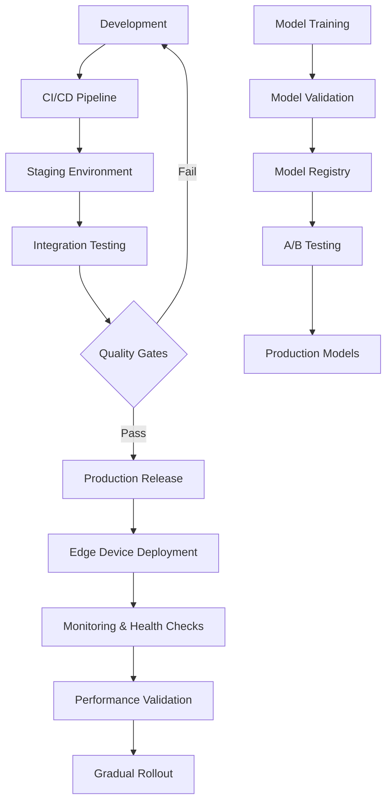

# Deployment Guide for Liquid Edge LLN Kit

## Overview

This guide provides comprehensive deployment strategies for the Liquid Edge LLN Kit across different environments, from development to production edge devices, with emphasis on reliability, security, and performance optimization.

## Deployment Architecture



## Environment Configuration

### Development Environment
```bash
# Development setup script
#!/bin/bash
# scripts/setup_dev_environment.sh

set -e

echo "Setting up Liquid Edge LLN Kit development environment..."

# Create virtual environment
python3 -m venv venv
source venv/bin/activate

# Upgrade pip and install build tools
pip install --upgrade pip setuptools wheel

# Install package in development mode
pip install -e ".[dev,deployment,ros2]"

# Install additional development tools
pip install \
    jupyter \
    jupyterlab \
    ipywidgets \
    tensorboard \
    wandb

# Setup pre-commit hooks
pre-commit install

# Initialize Git LFS for large model files
git lfs install
git lfs track "*.liquid"
git lfs track "*.onnx"
git lfs track "*.tflite"

# Create development directories
mkdir -p {data,models,experiments,logs,artifacts}

# Download sample datasets
if [ ! -d "data/samples" ]; then
    echo "Downloading sample datasets..."
    mkdir -p data/samples
    # This would download actual sample data
    curl -o data/samples/robot_sensor_data.npz \
         "https://github.com/liquid-edge/sample-data/releases/download/v1.0/robot_sensor_data.npz"
fi

# Setup development configuration
cat > config/dev_config.yaml << EOF
environment: development
debug: true
logging:
  level: DEBUG
  structured: true
  
monitoring:
  enabled: true
  metrics_port: 8080
  
hardware:
  simulation_mode: true
  
model:
  auto_reload: true
  checkpoint_interval: 100
EOF

echo "Development environment setup complete!"
echo "Activate with: source venv/bin/activate"
echo "Run tests with: pytest"
echo "Start development server with: liquid-lln dev-server"
```

### Staging Environment
```yaml
# docker/staging/docker-compose.yml
version: '3.8'

services:
  liquid-edge-api:
    build:
      context: ../../
      dockerfile: docker/Dockerfile.staging
    environment:
      - ENVIRONMENT=staging
      - LOG_LEVEL=INFO
      - METRICS_ENABLED=true
      - MODEL_REGISTRY_URL=http://model-registry:8080
    ports:
      - "8000:8000"
    volumes:
      - model_cache:/app/models
      - ./config:/app/config:ro
    depends_on:
      - model-registry
      - prometheus
      - jaeger
    healthcheck:
      test: ["CMD", "curl", "-f", "http://localhost:8000/health"]
      interval: 30s
      timeout: 10s
      retries: 3
      start_period: 40s

  model-registry:
    image: mlflow/mlflow:2.8.1
    environment:
      - MLFLOW_BACKEND_STORE_URI=sqlite:///mlflow.db
      - MLFLOW_DEFAULT_ARTIFACT_ROOT=/app/artifacts
    ports:
      - "5000:5000"
    volumes:
      - mlflow_data:/app/artifacts
    command: mlflow server --host 0.0.0.0 --port 5000

  prometheus:
    image: prom/prometheus:v2.45.0
    ports:
      - "9090:9090"
    volumes:
      - ./monitoring/prometheus.yml:/etc/prometheus/prometheus.yml:ro
      - prometheus_data:/prometheus
    command:
      - '--config.file=/etc/prometheus/prometheus.yml'
      - '--storage.tsdb.path=/prometheus'
      - '--web.console.libraries=/etc/prometheus/console_libraries'
      - '--web.console.templates=/etc/prometheus/consoles'

  grafana:
    image: grafana/grafana:10.1.0
    ports:
      - "3000:3000"
    environment:
      - GF_SECURITY_ADMIN_PASSWORD=liquid-edge-staging
    volumes:
      - grafana_data:/var/lib/grafana
      - ./monitoring/grafana/dashboards:/etc/grafana/provisioning/dashboards:ro
      - ./monitoring/grafana/datasources:/etc/grafana/provisioning/datasources:ro

  jaeger:
    image: jaegertracing/all-in-one:1.49
    ports:
      - "16686:16686"
      - "14268:14268"
    environment:
      - COLLECTOR_OTLP_ENABLED=true

volumes:
  model_cache:
  mlflow_data:
  prometheus_data:
  grafana_data:
```

### Production Edge Deployment
```bash
# scripts/deploy_edge_device.sh
#!/bin/bash
# Production edge device deployment script

set -e

DEVICE_TYPE=${1:-"generic"}
DEVICE_ID=${2:-$(hostnamectl --static)}
MODEL_VERSION=${3:-"latest"}
DEPLOYMENT_ENV=${4:-"production"}

echo "Deploying Liquid Edge LLN Kit to device: $DEVICE_ID"
echo "Device type: $DEVICE_TYPE"
echo "Model version: $MODEL_VERSION"
echo "Environment: $DEPLOYMENT_ENV"

# Pre-deployment checks
check_system_requirements() {
    echo "Checking system requirements..."
    
    # Check Python version
    python_version=$(python3 --version | grep -oP '\d+\.\d+')
    if (( $(echo "$python_version < 3.10" | bc -l) )); then
        echo "Error: Python 3.10+ required, found $python_version"
        exit 1
    fi
    
    # Check available memory
    available_memory=$(free -m | awk 'NR==2{printf "%.0f", $7}')
    if [ "$available_memory" -lt 512 ]; then
        echo "Warning: Low memory available: ${available_memory}MB"
    fi
    
    # Check disk space
    available_disk=$(df / | awk 'NR==2 {printf "%.0f", $4/1024}')
    if [ "$available_disk" -lt 1024 ]; then
        echo "Error: Insufficient disk space: ${available_disk}MB available"
        exit 1
    fi
    
    echo "System requirements check passed"
}

# Download and verify model
download_model() {
    echo "Downloading model version: $MODEL_VERSION"
    
    model_url="https://models.liquid-edge.com/releases/${MODEL_VERSION}/liquid_model.tar.gz"
    model_hash_url="https://models.liquid-edge.com/releases/${MODEL_VERSION}/liquid_model.tar.gz.sha256"
    
    # Download model and hash
    curl -L -o /tmp/liquid_model.tar.gz "$model_url"
    curl -L -o /tmp/liquid_model.tar.gz.sha256 "$model_hash_url"
    
    # Verify integrity
    cd /tmp
    sha256sum -c liquid_model.tar.gz.sha256
    
    # Extract model
    sudo mkdir -p /opt/liquid-edge/models
    sudo tar -xzf liquid_model.tar.gz -C /opt/liquid-edge/models
    
    echo "Model downloaded and verified successfully"
}

# Install system dependencies
install_system_dependencies() {
    echo "Installing system dependencies..."
    
    case "$DEVICE_TYPE" in
        "esp32")
            # ESP32-specific dependencies
            sudo apt-get update
            sudo apt-get install -y esp-idf micropython
            ;;
        "stm32")
            # STM32-specific dependencies
            sudo apt-get update
            sudo apt-get install -y gcc-arm-none-eabi openocd
            ;;
        "raspberry-pi")
            # Raspberry Pi optimizations
            sudo apt-get update
            sudo apt-get install -y python3-numpy python3-scipy
            # Enable hardware-specific optimizations
            echo "gpu_mem=128" | sudo tee -a /boot/config.txt
            ;;
        *)
            # Generic Linux dependencies
            sudo apt-get update
            sudo apt-get install -y python3-pip python3-venv build-essential
            ;;
    esac
}

# Create deployment user and directories
setup_deployment_structure() {
    echo "Setting up deployment structure..."
    
    # Create liquid-edge user if not exists
    if ! id "liquid-edge" &>/dev/null; then
        sudo useradd -r -m -s /bin/bash liquid-edge
    fi
    
    # Create directory structure
    sudo mkdir -p /opt/liquid-edge/{bin,lib,etc,var/log,var/run}
    sudo mkdir -p /etc/liquid-edge
    sudo mkdir -p /var/log/liquid-edge
    
    # Set permissions
    sudo chown -R liquid-edge:liquid-edge /opt/liquid-edge
    sudo chown -R liquid-edge:liquid-edge /var/log/liquid-edge
    sudo chmod 755 /opt/liquid-edge
    sudo chmod 750 /var/log/liquid-edge
}

# Install application
install_application() {
    echo "Installing Liquid Edge application..."
    
    # Create virtual environment
    sudo -u liquid-edge python3 -m venv /opt/liquid-edge/venv
    
    # Install package
    sudo -u liquid-edge /opt/liquid-edge/venv/bin/pip install --upgrade pip
    sudo -u liquid-edge /opt/liquid-edge/venv/bin/pip install "liquid-edge-lln[deployment]==$MODEL_VERSION"
    
    # Install device-specific optimizations
    case "$DEVICE_TYPE" in
        "raspberry-pi")
            sudo -u liquid-edge /opt/liquid-edge/venv/bin/pip install "liquid-edge-lln[rpi]"
            ;;
        "jetson")
            sudo -u liquid-edge /opt/liquid-edge/venv/bin/pip install "liquid-edge-lln[jetson]"
            ;;
    esac
}

# Configure application
configure_application() {
    echo "Configuring application..."
    
    # Generate device-specific configuration
    cat > /tmp/liquid_edge_config.yaml << EOF
device:
  id: "$DEVICE_ID"
  type: "$DEVICE_TYPE"
  environment: "$DEPLOYMENT_ENV"

model:
  path: "/opt/liquid-edge/models/liquid_model"
  version: "$MODEL_VERSION"
  auto_update: $([ "$DEPLOYMENT_ENV" = "production" ] && echo "false" || echo "true")

logging:
  level: $([ "$DEPLOYMENT_ENV" = "production" ] && echo "INFO" || echo "DEBUG")
  file: "/var/log/liquid-edge/liquid_edge.log"
  max_size: "100MB"
  backup_count: 5
  structured: true

monitoring:
  enabled: true
  metrics_port: 8080
  health_check_port: 8081
  telemetry_endpoint: "https://telemetry.liquid-edge.com"

security:
  enable_tls: $([ "$DEPLOYMENT_ENV" = "production" ] && echo "true" || echo "false")
  cert_path: "/etc/liquid-edge/certs/device.crt"
  key_path: "/etc/liquid-edge/certs/device.key"
  verify_model_signatures: true

performance:
  max_inference_threads: $(nproc)
  memory_limit_mb: 512
  cpu_affinity: "auto"
  
hardware:
  enable_hardware_acceleration: true
  power_management: "balanced"
  temperature_limit_celsius: 85
EOF
    
    sudo mv /tmp/liquid_edge_config.yaml /etc/liquid-edge/config.yaml
    sudo chown liquid-edge:liquid-edge /etc/liquid-edge/config.yaml
    sudo chmod 640 /etc/liquid-edge/config.yaml
}

# Setup systemd service
setup_systemd_service() {
    echo "Setting up systemd service..."
    
    cat > /tmp/liquid-edge.service << EOF
[Unit]
Description=Liquid Edge LLN Kit Service
After=network.target
Wants=network.target

[Service]
Type=simple
User=liquid-edge
Group=liquid-edge
WorkingDirectory=/opt/liquid-edge
Environment=PATH=/opt/liquid-edge/venv/bin
ExecStart=/opt/liquid-edge/venv/bin/liquid-lln serve --config /etc/liquid-edge/config.yaml
ExecReload=/bin/kill -HUP \$MAINPID
Restart=always
RestartSec=10
StandardOutput=journal
StandardError=journal
SyslogIdentifier=liquid-edge

# Security settings
NoNewPrivileges=true
PrivateTmp=true
ProtectSystem=strict
ProtectHome=true
ReadWritePaths=/var/log/liquid-edge /opt/liquid-edge/var

# Resource limits
LimitNOFILE=65536
MemoryLimit=1G
CPUQuota=80%

[Install]
WantedBy=multi-user.target
EOF
    
    sudo mv /tmp/liquid-edge.service /etc/systemd/system/
    sudo systemctl daemon-reload
    sudo systemctl enable liquid-edge
}

# Setup log rotation
setup_log_rotation() {
    echo "Setting up log rotation..."
    
    cat > /tmp/liquid-edge-logrotate << EOF
/var/log/liquid-edge/*.log {
    daily
    missingok
    rotate 30
    compress
    delaycompress
    notifempty
    create 644 liquid-edge liquid-edge
    postrotate
        systemctl reload liquid-edge
    endscript
}
EOF
    
    sudo mv /tmp/liquid-edge-logrotate /etc/logrotate.d/liquid-edge
}

# Health check script
setup_health_checks() {
    echo "Setting up health checks..."
    
    cat > /tmp/health_check.sh << 'EOF'
#!/bin/bash
# Health check script for Liquid Edge deployment

DEVICE_ID=$(hostname)
HEALTH_URL="http://localhost:8081/health"
LOG_FILE="/var/log/liquid-edge/health_check.log"

log_message() {
    echo "$(date -Iseconds) - $1" >> "$LOG_FILE"
}

# Check service status
if ! systemctl is-active --quiet liquid-edge; then
    log_message "ERROR: liquid-edge service is not running"
    exit 1
fi

# Check HTTP health endpoint
if ! curl -sf "$HEALTH_URL" > /dev/null 2>&1; then
    log_message "ERROR: Health endpoint not responding"
    exit 1
fi

# Check memory usage
memory_usage=$(free | awk 'NR==2{printf "%.0f", $3*100/$2}')
if [ "$memory_usage" -gt 90 ]; then
    log_message "WARNING: High memory usage: ${memory_usage}%"
fi

# Check disk usage
disk_usage=$(df /opt/liquid-edge | awk 'NR==2 {printf "%.0f", $5}' | sed 's/%//')
if [ "$disk_usage" -gt 85 ]; then
    log_message "WARNING: High disk usage: ${disk_usage}%"
fi

# Check temperature (if available)
if [ -f /sys/class/thermal/thermal_zone0/temp ]; then
    temp=$(cat /sys/class/thermal/thermal_zone0/temp)
    temp_celsius=$((temp / 1000))
    if [ "$temp_celsius" -gt 80 ]; then
        log_message "WARNING: High temperature: ${temp_celsius}°C"
    fi
fi

log_message "INFO: Health check passed"
exit 0
EOF
    
    sudo mv /tmp/health_check.sh /opt/liquid-edge/bin/health_check.sh
    sudo chmod +x /opt/liquid-edge/bin/health_check.sh
    sudo chown liquid-edge:liquid-edge /opt/liquid-edge/bin/health_check.sh
    
    # Setup cron job for health checks
    echo "*/5 * * * * liquid-edge /opt/liquid-edge/bin/health_check.sh" | sudo tee /etc/cron.d/liquid-edge-health
}

# Post-deployment validation
validate_deployment() {
    echo "Validating deployment..."
    
    # Start service
    sudo systemctl start liquid-edge
    
    # Wait for service to be ready
    sleep 10
    
    # Check service status
    if ! systemctl is-active --quiet liquid-edge; then
        echo "ERROR: Service failed to start"
        sudo journalctl -u liquid-edge --no-pager -n 50
        exit 1
    fi
    
    # Check health endpoint
    if ! curl -sf http://localhost:8081/health > /dev/null; then
        echo "ERROR: Health endpoint not responding"
        exit 1
    fi
    
    # Run basic inference test
    if ! /opt/liquid-edge/venv/bin/liquid-lln test-inference; then
        echo "ERROR: Inference test failed"
        exit 1
    fi
    
    echo "Deployment validation passed"
}

# Main deployment flow
main() {
    check_system_requirements
    install_system_dependencies
    setup_deployment_structure
    download_model
    install_application
    configure_application
    setup_systemd_service
    setup_log_rotation
    setup_health_checks
    validate_deployment
    
    echo "Deployment completed successfully!"
    echo "Service status: $(systemctl is-active liquid-edge)"
    echo "Logs: sudo journalctl -u liquid-edge -f"
    echo "Health check: curl http://localhost:8081/health"
}

# Run main function
main "$@"
```

## Container Deployment

### Production Dockerfile
```dockerfile
# docker/Dockerfile.production
FROM python:3.11-slim as builder

WORKDIR /app

# Install build dependencies
RUN apt-get update && apt-get install -y \
    gcc \
    g++ \
    libc6-dev \
    libffi-dev \
    && rm -rf /var/lib/apt/lists/*

# Copy requirements and install Python dependencies
COPY pyproject.toml ./
RUN pip install --no-cache-dir build && \
    python -m build --wheel

FROM python:3.11-slim as production

# Create non-root user
RUN groupadd -r liquid && useradd -r -g liquid liquid

# Install runtime dependencies
RUN apt-get update && apt-get install -y \
    curl \
    && rm -rf /var/lib/apt/lists/*

# Copy application
WORKDIR /app
COPY --from=builder /app/dist/*.whl /tmp/
RUN pip install --no-cache-dir /tmp/*.whl[deployment] && \
    rm /tmp/*.whl

# Create necessary directories
RUN mkdir -p /app/{models,logs,config} && \
    chown -R liquid:liquid /app

# Copy configuration
COPY docker/config/production.yaml /app/config/config.yaml

# Switch to non-root user
USER liquid

# Health check
HEALTHCHECK --interval=30s --timeout=10s --start-period=40s --retries=3 \
    CMD curl -f http://localhost:8081/health || exit 1

# Expose ports
EXPOSE 8000 8080 8081

# Set environment variables
ENV PYTHONPATH=/app
ENV LIQUID_EDGE_CONFIG=/app/config/config.yaml

# Start application
CMD ["liquid-lln", "serve", "--config", "/app/config/config.yaml"]
```

### Kubernetes Deployment
```yaml
# k8s/liquid-edge-deployment.yaml
apiVersion: apps/v1
kind: Deployment
metadata:
  name: liquid-edge-lln
  labels:
    app: liquid-edge-lln
    version: v1.0.0
spec:
  replicas: 3
  selector:
    matchLabels:
      app: liquid-edge-lln
  template:
    metadata:
      labels:
        app: liquid-edge-lln
        version: v1.0.0
    spec:
      serviceAccountName: liquid-edge-sa
      containers:
      - name: liquid-edge-lln
        image: liquid-edge/lln-kit:1.0.0
        ports:
        - containerPort: 8000
          name: api
        - containerPort: 8080
          name: metrics
        - containerPort: 8081
          name: health
        env:
        - name: DEVICE_ID
          valueFrom:
            fieldRef:
              fieldPath: metadata.name
        - name: ENVIRONMENT
          value: "production"
        resources:
          requests:
            memory: "256Mi"
            cpu: "100m"
          limits:
            memory: "1Gi"
            cpu: "500m"
        livenessProbe:
          httpGet:
            path: /health
            port: 8081
          initialDelaySeconds: 30
          periodSeconds: 10
        readinessProbe:
          httpGet:
            path: /ready
            port: 8081
          initialDelaySeconds: 5
          periodSeconds: 5
        volumeMounts:
        - name: config-volume
          mountPath: /app/config
          readOnly: true
        - name: models-volume
          mountPath: /app/models
          readOnly: true
        - name: logs-volume
          mountPath: /app/logs
      volumes:
      - name: config-volume
        configMap:
          name: liquid-edge-config
      - name: models-volume
        persistentVolumeClaim:
          claimName: liquid-edge-models-pvc
      - name: logs-volume
        emptyDir: {}
      nodeSelector:
        kubernetes.io/arch: amd64
      tolerations:
      - key: "edge-device"
        operator: "Equal"
        value: "true"
        effect: "NoSchedule"

---
apiVersion: v1
kind: Service
metadata:
  name: liquid-edge-service
  labels:
    app: liquid-edge-lln
spec:
  selector:
    app: liquid-edge-lln
  ports:
  - name: api
    port: 8000
    targetPort: 8000
  - name: metrics
    port: 8080
    targetPort: 8080
  type: ClusterIP

---
apiVersion: v1
kind: ConfigMap
metadata:
  name: liquid-edge-config
data:
  config.yaml: |
    device:
      environment: "production"
    model:
      path: "/app/models/liquid_model"
      auto_update: false
    logging:
      level: "INFO"
      structured: true
    monitoring:
      enabled: true
      metrics_port: 8080
      health_check_port: 8081
    security:
      enable_tls: true
      verify_model_signatures: true
    performance:
      max_inference_threads: 4
      memory_limit_mb: 512
```

## Rollback Procedures

### Automated Rollback Script
```bash
# scripts/rollback_deployment.sh
#!/bin/bash
# Automated rollback script for failed deployments

set -e

ROLLBACK_VERSION=${1:-"previous"}
DEVICE_ID=${2:-$(hostnamectl --static)}
ENVIRONMENT=${3:-"production"}

echo "Initiating rollback to version: $ROLLBACK_VERSION"
echo "Device: $DEVICE_ID"
echo "Environment: $ENVIRONMENT"

# Pre-rollback checks
check_rollback_prerequisites() {
    echo "Checking rollback prerequisites..."
    
    # Check if backup exists
    if [ ! -d "/opt/liquid-edge/backups/$ROLLBACK_VERSION" ]; then
        echo "ERROR: Backup for version $ROLLBACK_VERSION not found"
        exit 1
    fi
    
    # Check service status
    if ! systemctl is-active --quiet liquid-edge; then
        echo "WARNING: Service is not running, continuing with rollback"
    fi
    
    echo "Prerequisites check passed"
}

# Stop current service
stop_current_service() {
    echo "Stopping current service..."
    sudo systemctl stop liquid-edge || true
    
    # Wait for graceful shutdown
    sleep 5
    
    # Force kill if still running
    if pgrep -f "liquid-lln" > /dev/null; then
        echo "Force stopping remaining processes..."
        sudo pkill -f "liquid-lln"
        sleep 2
    fi
}

# Backup current state
backup_current_state() {
    echo "Backing up current state..."
    
    backup_dir="/opt/liquid-edge/backups/pre-rollback-$(date +%Y%m%d-%H%M%S)"
    sudo mkdir -p "$backup_dir"
    
    # Backup configuration
    sudo cp -r /etc/liquid-edge "$backup_dir/"
    
    # Backup models
    sudo cp -r /opt/liquid-edge/models "$backup_dir/"
    
    # Backup application
    sudo cp -r /opt/liquid-edge/venv "$backup_dir/"
    
    echo "Current state backed up to: $backup_dir"
}

# Restore previous version
restore_previous_version() {
    echo "Restoring version: $ROLLBACK_VERSION"
    
    backup_path="/opt/liquid-edge/backups/$ROLLBACK_VERSION"
    
    # Restore configuration
    if [ -d "$backup_path/liquid-edge" ]; then
        sudo rm -rf /etc/liquid-edge
        sudo cp -r "$backup_path/liquid-edge" /etc/
    fi
    
    # Restore models
    if [ -d "$backup_path/models" ]; then
        sudo rm -rf /opt/liquid-edge/models
        sudo cp -r "$backup_path/models" /opt/liquid-edge/
    fi
    
    # Restore application
    if [ -d "$backup_path/venv" ]; then
        sudo rm -rf /opt/liquid-edge/venv
        sudo cp -r "$backup_path/venv" /opt/liquid-edge/
    fi
    
    # Fix permissions
    sudo chown -R liquid-edge:liquid-edge /opt/liquid-edge
    sudo chown -R liquid-edge:liquid-edge /etc/liquid-edge
}

# Validate rollback
validate_rollback() {
    echo "Validating rollback..."
    
    # Start service
    sudo systemctl start liquid-edge
    
    # Wait for startup
    sleep 15
    
    # Check service status
    if ! systemctl is-active --quiet liquid-edge; then
        echo "ERROR: Service failed to start after rollback"
        sudo journalctl -u liquid-edge --no-pager -n 50
        return 1
    fi
    
    # Check health endpoint
    max_attempts=10
    attempt=0
    
    while [ $attempt -lt $max_attempts ]; do
        if curl -sf http://localhost:8081/health > /dev/null 2>&1; then
            echo "Health check passed"
            break
        fi
        
        attempt=$((attempt + 1))
        echo "Health check attempt $attempt/$max_attempts failed, retrying..."
        sleep 3
    done
    
    if [ $attempt -eq $max_attempts ]; then
        echo "ERROR: Health check failed after rollback"
        return 1
    fi
    
    # Run inference test
    if ! /opt/liquid-edge/venv/bin/liquid-lln test-inference; then
        echo "ERROR: Inference test failed after rollback"
        return 1
    fi
    
    echo "Rollback validation passed"
}

# Send notification
send_notification() {
    local status=$1
    local message="Rollback $status for device $DEVICE_ID to version $ROLLBACK_VERSION"
    
    # Send to monitoring system
    curl -X POST "https://monitoring.liquid-edge.com/api/events" \
         -H "Content-Type: application/json" \
         -d "{
             \"device_id\": \"$DEVICE_ID\",
             \"event_type\": \"rollback_$status\",
             \"message\": \"$message\",
             \"timestamp\": \"$(date -Iseconds)\",
             \"version\": \"$ROLLBACK_VERSION\"
         }" 2>/dev/null || true
    
    # Log locally
    echo "$(date -Iseconds) - $message" >> /var/log/liquid-edge/rollback.log
}

# Main rollback procedure
main() {
    send_notification "started"
    
    if check_rollback_prerequisites && \
       stop_current_service && \
       backup_current_state && \
       restore_previous_version && \
       validate_rollback; then
        
        send_notification "completed"
        echo "Rollback completed successfully!"
        echo "Service status: $(systemctl is-active liquid-edge)"
        exit 0
    else
        send_notification "failed"
        echo "Rollback failed! Check logs for details."
        exit 1
    fi
}

# Run main function
main "$@"
```

This comprehensive deployment guide ensures reliable, secure, and efficient deployment of the Liquid Edge LLN Kit across various environments and platforms, with robust rollback capabilities for production safety.