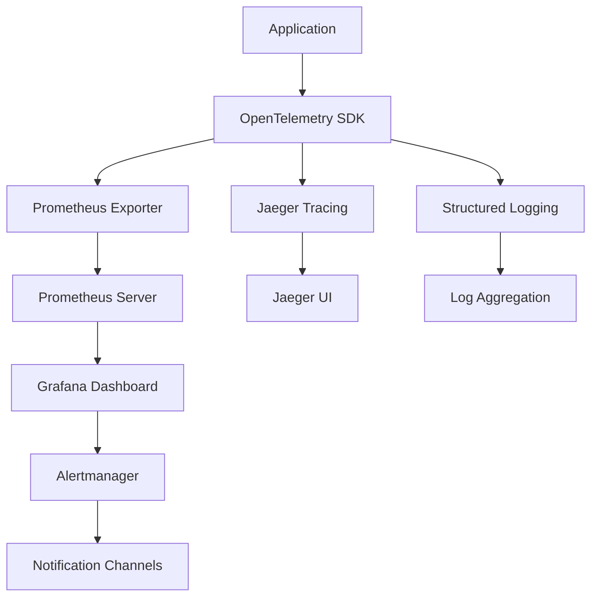

# Monitoring and Observability Guide

## Overview

This document outlines the comprehensive monitoring and observability strategy for the Liquid Edge LLN Kit, including metrics collection, alerting, and performance monitoring.

## Architecture



## Metrics Collection

### Application Metrics

#### Performance Metrics
```python
from opentelemetry import metrics
from opentelemetry.sdk.metrics import MeterProvider
from prometheus_client import Counter, Histogram, Gauge

# Model inference metrics
inference_duration = Histogram(
    'liquid_nn_inference_duration_seconds',
    'Time spent in model inference',
    buckets=[0.001, 0.005, 0.01, 0.05, 0.1, 0.5, 1.0]
)

inference_requests = Counter(
    'liquid_nn_inference_requests_total',
    'Total number of inference requests',
    ['model_type', 'device']
)

model_accuracy = Gauge(
    'liquid_nn_model_accuracy',
    'Current model accuracy score',
    ['model_name', 'dataset']
)

# Resource usage metrics
memory_usage = Gauge(
    'liquid_nn_memory_usage_bytes',
    'Memory usage in bytes',
    ['component']
)

cpu_utilization = Gauge(
    'liquid_nn_cpu_utilization_percent',
    'CPU utilization percentage',
    ['core']
)
```

#### Business Metrics
```python
# Training metrics
training_loss = Gauge(
    'liquid_nn_training_loss',
    'Current training loss',
    ['model_name', 'epoch']
)

model_deployments = Counter(
    'liquid_nn_model_deployments_total',
    'Total number of model deployments',
    ['target_platform', 'status']
)

# User engagement metrics
api_usage = Counter(
    'liquid_nn_api_calls_total',
    'Total API calls',
    ['endpoint', 'method', 'status']
)

active_models = Gauge(
    'liquid_nn_active_models',
    'Number of active models in production',
    ['environment']
)
```

### Infrastructure Metrics

#### System Health
- CPU usage and load average
- Memory utilization and swap usage
- Disk I/O and space utilization
- Network throughput and error rates
- Container resource consumption

#### Application Health
- Process uptime and restart count
- HTTP response times and error rates
- Database connection pool status
- Queue depth and processing rate
- Cache hit/miss ratios

## Distributed Tracing

### Trace Configuration
```python
from opentelemetry import trace
from opentelemetry.exporter.jaeger.thrift import JaegerExporter
from opentelemetry.sdk.trace import TracerProvider
from opentelemetry.sdk.trace.export import BatchSpanProcessor

# Configure tracing
trace.set_tracer_provider(TracerProvider())
tracer = trace.get_tracer(__name__)

jaeger_exporter = JaegerExporter(
    agent_host_name="jaeger-agent",
    agent_port=6831,
)

span_processor = BatchSpanProcessor(jaeger_exporter)
trace.get_tracer_provider().add_span_processor(span_processor)
```

### Instrumentation Example
```python
@tracer.start_as_current_span("liquid_nn_inference")
def run_inference(model, input_data):
    with tracer.start_as_current_span("preprocess_input") as span:
        span.set_attribute("input.shape", str(input_data.shape))
        processed_input = preprocess(input_data)
    
    with tracer.start_as_current_span("model_forward_pass") as span:
        span.set_attribute("model.type", model.__class__.__name__)
        span.set_attribute("model.parameters", model.num_parameters)
        result = model(processed_input)
    
    with tracer.start_as_current_span("postprocess_output") as span:
        span.set_attribute("output.shape", str(result.shape))
        final_result = postprocess(result)
    
    return final_result
```

## Structured Logging

### Log Configuration
```python
import structlog

# Configure structured logging
structlog.configure(
    processors=[
        structlog.stdlib.filter_by_level,
        structlog.stdlib.add_logger_name,
        structlog.stdlib.add_log_level,
        structlog.stdlib.PositionalArgumentsFormatter(),
        structlog.processors.TimeStamper(fmt="iso"),
        structlog.processors.StackInfoRenderer(),
        structlog.processors.format_exc_info,
        structlog.processors.UnicodeDecoder(),
        structlog.processors.JSONRenderer()
    ],
    context_class=dict,
    logger_factory=structlog.stdlib.LoggerFactory(),
    cache_logger_on_first_use=True,
)

logger = structlog.get_logger()
```

### Logging Best Practices
```python
# Training progress logging
logger.info(
    "training_epoch_completed",
    epoch=epoch_num,
    loss=current_loss,
    accuracy=current_accuracy,
    learning_rate=current_lr,
    duration_seconds=epoch_duration
)

# Model deployment logging
logger.info(
    "model_deployment_started",
    model_name=model.name,
    model_version=model.version,
    target_platform=deployment.platform,
    deployment_id=deployment.id
)

# Error logging with context
try:
    result = deploy_model(model, target)
except DeploymentError as e:
    logger.error(
        "model_deployment_failed",
        model_name=model.name,
        target_platform=target.platform,
        error_type=type(e).__name__,
        error_message=str(e),
        traceback=traceback.format_exc()
    )
```

## Alerting Rules

### Prometheus Alerting Rules
```yaml
# alerts.yml
groups:
  - name: liquid_nn_alerts
    rules:
      # High error rate alert
      - alert: HighErrorRate
        expr: rate(liquid_nn_api_calls_total{status=~"5.."}[5m]) > 0.1
        for: 2m
        labels:
          severity: warning
        annotations:
          summary: "High error rate detected"
          description: "Error rate is {{ $value }} errors per second"
      
      # Memory usage alert
      - alert: HighMemoryUsage
        expr: liquid_nn_memory_usage_bytes / (1024^3) > 8
        for: 5m
        labels:
          severity: critical
        annotations:
          summary: "High memory usage"
          description: "Memory usage is {{ $value }}GB"
      
      # Model accuracy degradation
      - alert: ModelAccuracyDegradation
        expr: liquid_nn_model_accuracy < 0.85
        for: 10m
        labels:
          severity: warning
        annotations:
          summary: "Model accuracy below threshold"
          description: "Model {{ $labels.model_name }} accuracy is {{ $value }}"
      
      # Training job failure
      - alert: TrainingJobFailed
        expr: increase(liquid_nn_training_jobs_failed_total[10m]) > 0
        labels:
          severity: critical
        annotations:
          summary: "Training job failed"
          description: "Training job for model {{ $labels.model_name }} failed"
```

### Alertmanager Configuration
```yaml
# alertmanager.yml
global:
  smtp_smarthost: 'localhost:587'
  smtp_from: 'alerts@liquid-edge.ai'

route:
  group_by: ['alertname']
  group_wait: 10s
  group_interval: 10s
  repeat_interval: 1h
  receiver: 'web.hook'
  routes:
    - match:
        severity: critical
      receiver: 'critical-alerts'
    - match:
        severity: warning
      receiver: 'warning-alerts'

receivers:
  - name: 'web.hook'
    webhook_configs:
      - url: 'http://127.0.0.1:5001/'
  
  - name: 'critical-alerts'
    email_configs:
      - to: 'oncall@liquid-edge.ai'
        subject: 'CRITICAL: {{ range .Alerts }}{{ .Annotations.summary }}{{ end }}'
        body: |
          {{ range .Alerts }}
          Alert: {{ .Annotations.summary }}
          Description: {{ .Annotations.description }}
          {{ end }}
    slack_configs:
      - api_url: 'YOUR_SLACK_WEBHOOK_URL'
        channel: '#alerts'
        title: 'Critical Alert'
  
  - name: 'warning-alerts'
    email_configs:
      - to: 'team@liquid-edge.ai'
        subject: 'WARNING: {{ range .Alerts }}{{ .Annotations.summary }}{{ end }}'
```

## Dashboard Configuration

### Grafana Dashboard JSON
```json
{
  "dashboard": {
    "id": null,
    "title": "Liquid Edge LLN Kit Monitoring",
    "panels": [
      {
        "title": "Inference Latency",
        "type": "graph",
        "targets": [
          {
            "expr": "histogram_quantile(0.95, rate(liquid_nn_inference_duration_seconds_bucket[5m]))",
            "legendFormat": "95th percentile"
          },
          {
            "expr": "histogram_quantile(0.50, rate(liquid_nn_inference_duration_seconds_bucket[5m]))",
            "legendFormat": "50th percentile"
          }
        ]
      },
      {
        "title": "Request Rate",
        "type": "graph",
        "targets": [
          {
            "expr": "rate(liquid_nn_inference_requests_total[5m])",
            "legendFormat": "{{ model_type }} on {{ device }}"
          }
        ]
      },
      {
        "title": "Model Accuracy",
        "type": "singlestat",
        "targets": [
          {
            "expr": "liquid_nn_model_accuracy",
            "legendFormat": "{{ model_name }}"
          }
        ]
      },
      {
        "title": "Resource Usage",
        "type": "graph",
        "targets": [
          {
            "expr": "liquid_nn_memory_usage_bytes / (1024^3)",
            "legendFormat": "Memory (GB)"
          },
          {
            "expr": "liquid_nn_cpu_utilization_percent",
            "legendFormat": "CPU %"
          }
        ]
      }
    ]
  }
}
```

## Health Checks

### Application Health Endpoint
```python
from flask import Flask, jsonify
import psutil
import time

app = Flask(__name__)
start_time = time.time()

@app.route('/health')
def health_check():
    """Comprehensive health check endpoint"""
    
    # Basic service availability
    status = {
        "status": "healthy",
        "timestamp": time.time(),
        "uptime": time.time() - start_time,
        "version": "0.1.0"
    }
    
    # Resource checks
    memory = psutil.virtual_memory()
    disk = psutil.disk_usage('/')
    cpu = psutil.cpu_percent(interval=1)
    
    status["resources"] = {
        "memory_usage_percent": memory.percent,
        "memory_available_gb": memory.available / (1024**3),
        "disk_usage_percent": disk.percent,
        "disk_free_gb": disk.free / (1024**3),
        "cpu_usage_percent": cpu
    }
    
    # Component health checks
    status["components"] = {
        "database": check_database_health(),
        "model_cache": check_model_cache_health(),
        "external_apis": check_external_apis_health()
    }
    
    # Determine overall status
    if any(component["status"] != "healthy" for component in status["components"].values()):
        status["status"] = "degraded"
    
    if memory.percent > 90 or disk.percent > 90 or cpu > 90:
        status["status"] = "critical"
    
    return jsonify(status), 200 if status["status"] == "healthy" else 503

@app.route('/ready')
def readiness_check():
    """Kubernetes readiness probe"""
    if check_all_dependencies():
        return jsonify({"status": "ready"}), 200
    return jsonify({"status": "not ready"}), 503

@app.route('/live')
def liveness_check():
    """Kubernetes liveness probe"""
    return jsonify({"status": "alive"}), 200
```

## Performance Monitoring

### Continuous Performance Testing
```python
import time
import numpy as np
from prometheus_client import Histogram

# Performance benchmarking
inference_benchmark = Histogram(
    'liquid_nn_benchmark_duration_seconds',
    'Benchmark inference duration',
    buckets=[0.001, 0.005, 0.01, 0.05, 0.1]
)

@inference_benchmark.time()
def benchmark_inference():
    """Automated performance benchmark"""
    
    # Generate test data
    test_input = np.random.randn(1, 4)
    
    # Run inference
    start_time = time.time()
    result = model.predict(test_input)
    duration = time.time() - start_time
    
    # Record metrics
    inference_duration.observe(duration)
    
    # Performance regression check
    if duration > PERFORMANCE_THRESHOLD:
        logger.warning(
            "performance_regression_detected",
            duration=duration,
            threshold=PERFORMANCE_THRESHOLD
        )
    
    return result
```

## Log Analysis

### Log Processing Pipeline
```python
import re
from collections import defaultdict
import json

class LogAnalyzer:
    def __init__(self):
        self.error_patterns = [
            r"ERROR",
            r"CRITICAL",
            r"Exception",
            r"Traceback"
        ]
        self.metrics = defaultdict(int)
    
    def analyze_logs(self, log_file):
        """Analyze logs for patterns and anomalies"""
        
        with open(log_file, 'r') as f:
            for line in f:
                try:
                    log_entry = json.loads(line)
                    self.process_log_entry(log_entry)
                except json.JSONDecodeError:
                    continue
    
    def process_log_entry(self, entry):
        """Process individual log entry"""
        
        level = entry.get('level', '').upper()
        message = entry.get('message', '')
        
        # Count log levels
        self.metrics[f'log_level_{level.lower()}'] += 1
        
        # Detect error patterns
        for pattern in self.error_patterns:
            if re.search(pattern, message, re.IGNORECASE):
                self.metrics['error_patterns'] += 1
                break
        
        # Performance analysis
        if 'duration_seconds' in entry:
            duration = entry['duration_seconds']
            if duration > 1.0:
                self.metrics['slow_operations'] += 1
    
    def generate_report(self):
        """Generate analysis report"""
        return {
            "total_entries": sum(self.metrics.values()),
            "metrics": dict(self.metrics),
            "error_rate": self.metrics['error_patterns'] / max(1, sum(self.metrics.values())),
            "slow_operation_rate": self.metrics['slow_operations'] / max(1, sum(self.metrics.values()))
        }
```

## Incident Response

### Alert Escalation Matrix

| Alert Severity | Response Time | Escalation Path |
|----------------|---------------|-----------------|
| Critical | 15 minutes | On-call → Team Lead → Manager |
| High | 1 hour | Team Member → On-call → Team Lead |
| Medium | 4 hours | Team Member → Documentation |
| Low | Next business day | Team Member |

### Runbook Templates

#### High Memory Usage Response
1. **Immediate Actions**
   - Check current memory usage: `free -h`
   - Identify memory-consuming processes: `ps aux --sort=-%mem`
   - Review recent deployments and changes

2. **Investigation**
   - Check application logs for memory leaks
   - Analyze heap dumps if available
   - Review recent code changes

3. **Mitigation**
   - Restart affected services if necessary
   - Implement emergency memory limits
   - Scale horizontally if possible

4. **Resolution**
   - Fix underlying memory leak
   - Update monitoring thresholds
   - Document lessons learned

## Maintenance

### Regular Monitoring Tasks

#### Daily
- Review dashboard for anomalies
- Check alert status and resolution
- Verify backup and retention policies

#### Weekly
- Analyze performance trends
- Review and update alert thresholds
- Clean up old metrics and logs

#### Monthly
- Capacity planning review
- Dashboard and alert optimization
- Performance baseline updates

#### Quarterly
- Monitoring infrastructure updates
- Team training and documentation updates
- Tool evaluation and upgrades

---

For implementation details and configuration examples, see the `monitoring/` directory in this repository.