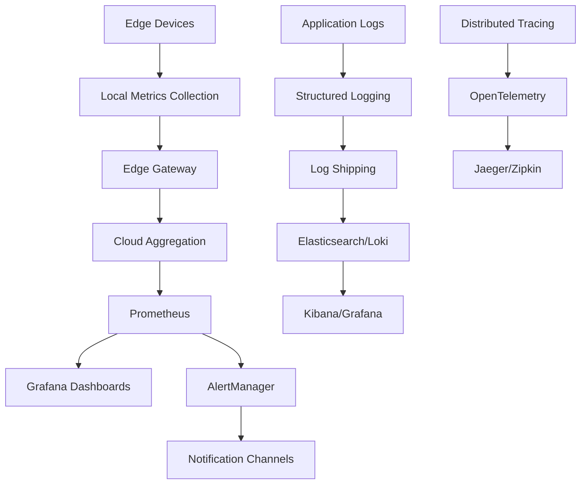

# Monitoring and Observability Guide

## Overview

This guide outlines comprehensive monitoring and observability strategies for the Liquid Edge LLN Kit, covering development, deployment, and production environments with special focus on edge device constraints.

## Monitoring Architecture



## Metrics Collection

### Core ML Metrics
```python
# src/liquid_edge/monitoring/metrics.py
import time
import psutil
import threading
from typing import Dict, Any, Optional
from dataclasses import dataclass
from prometheus_client import Counter, Histogram, Gauge, CollectorRegistry

@dataclass
class InferenceMetrics:
    """Core inference performance metrics."""
    inference_count: int = 0
    inference_latency_ms: float = 0.0
    memory_usage_mb: float = 0.0
    cpu_usage_percent: float = 0.0
    accuracy: Optional[float] = None
    energy_consumption_mw: Optional[float] = None

class LiquidMetricsCollector:
    """Comprehensive metrics collection for Liquid Neural Networks."""
    
    def __init__(self, device_id: str, registry: Optional[CollectorRegistry] = None):
        self.device_id = device_id
        self.registry = registry or CollectorRegistry()
        
        # Prometheus metrics
        self.inference_counter = Counter(
            'liquid_inference_total',
            'Total number of inferences performed',
            ['device_id', 'model_version'],
            registry=self.registry
        )
        
        self.inference_latency = Histogram(
            'liquid_inference_duration_seconds',
            'Inference latency in seconds',
            ['device_id', 'model_version'],
            buckets=[0.001, 0.005, 0.01, 0.025, 0.05, 0.1, 0.25, 0.5, 1.0],
            registry=self.registry
        )
        
        self.memory_usage = Gauge(
            'liquid_memory_usage_bytes',
            'Memory usage in bytes',
            ['device_id', 'memory_type'],
            registry=self.registry
        )
        
        self.cpu_usage = Gauge(
            'liquid_cpu_usage_percent',
            'CPU usage percentage',
            ['device_id', 'core'],
            registry=self.registry
        )
        
        self.model_accuracy = Gauge(
            'liquid_model_accuracy',
            'Current model accuracy',
            ['device_id', 'model_version', 'metric_type'],
            registry=self.registry
        )
        
        self.energy_consumption = Gauge(
            'liquid_energy_consumption_milliwatts',
            'Energy consumption in milliwatts',
            ['device_id', 'component'],
            registry=self.registry
        )
        
        # Internal state
        self._metrics_buffer = []
        self._monitoring_active = True
        self._monitor_thread = threading.Thread(target=self._monitor_system)
        self._monitor_thread.daemon = True
        self._monitor_thread.start()
    
    def record_inference(
        self, 
        latency_seconds: float, 
        model_version: str = "default",
        accuracy: Optional[float] = None
    ):
        """Record an inference operation."""
        self.inference_counter.labels(
            device_id=self.device_id,
            model_version=model_version
        ).inc()
        
        self.inference_latency.labels(
            device_id=self.device_id,
            model_version=model_version
        ).observe(latency_seconds)
        
        if accuracy is not None:
            self.model_accuracy.labels(
                device_id=self.device_id,
                model_version=model_version,
                metric_type='inference_accuracy'
            ).set(accuracy)
    
    def record_energy_consumption(self, component: str, milliwatts: float):
        """Record energy consumption for a component."""
        self.energy_consumption.labels(
            device_id=self.device_id,
            component=component
        ).set(milliwatts)
    
    def _monitor_system(self):
        """Background system monitoring."""
        while self._monitoring_active:
            try:
                # Memory usage
                memory_info = psutil.virtual_memory()
                self.memory_usage.labels(
                    device_id=self.device_id,
                    memory_type='virtual'
                ).set(memory_info.used)
                
                # CPU usage per core
                cpu_percents = psutil.cpu_percent(percpu=True)
                for i, cpu_percent in enumerate(cpu_percents):
                    self.cpu_usage.labels(
                        device_id=self.device_id,
                        core=str(i)
                    ).set(cpu_percent)
                
                time.sleep(5)  # Sample every 5 seconds
            
            except Exception as e:
                print(f"System monitoring error: {e}")
                time.sleep(10)
    
    def stop_monitoring(self):
        """Stop background monitoring."""
        self._monitoring_active = False
        self._monitor_thread.join(timeout=5)

# Edge-optimized metrics collection
class EdgeMetricsCollector:
    """Lightweight metrics collection for resource-constrained devices."""
    
    def __init__(self, device_id: str, max_buffer_size: int = 1000):
        self.device_id = device_id
        self.max_buffer_size = max_buffer_size
        self.metrics_buffer = []
        self.last_flush = time.time()
        
    def record_metric(self, metric_name: str, value: float, labels: Dict[str, str] = None):
        """Record a metric with automatic buffer management."""
        metric = {
            'timestamp': time.time(),
            'device_id': self.device_id,
            'metric_name': metric_name,
            'value': value,
            'labels': labels or {}
        }
        
        self.metrics_buffer.append(metric)
        
        # Auto-flush if buffer is full
        if len(self.metrics_buffer) >= self.max_buffer_size:
            self.flush_metrics()
    
    def flush_metrics(self) -> List[Dict[str, Any]]:
        """Flush metrics buffer and return data."""
        metrics = self.metrics_buffer.copy()
        self.metrics_buffer.clear()
        self.last_flush = time.time()
        return metrics
    
    def get_metrics_summary(self) -> Dict[str, Any]:
        """Get summary of collected metrics."""
        if not self.metrics_buffer:
            return {}
        
        summary = {
            'device_id': self.device_id,
            'buffer_size': len(self.metrics_buffer),
            'oldest_metric': min(m['timestamp'] for m in self.metrics_buffer),
            'newest_metric': max(m['timestamp'] for m in self.metrics_buffer),
            'metric_types': list(set(m['metric_name'] for m in self.metrics_buffer))
        }
        
        return summary
```

### Hardware-Specific Monitoring
```python
# src/liquid_edge/monitoring/hardware_monitor.py
import platform
from abc import ABC, abstractmethod
from typing import Dict, Any, Optional

class HardwareMonitor(ABC):
    """Abstract base class for hardware-specific monitoring."""
    
    @abstractmethod
    def get_temperature(self) -> Optional[float]:
        """Get device temperature in Celsius."""
        pass
    
    @abstractmethod
    def get_power_consumption(self) -> Optional[float]:
        """Get power consumption in milliwatts."""
        pass
    
    @abstractmethod
    def get_memory_info(self) -> Dict[str, int]:
        """Get memory usage information."""
        pass

class ESP32Monitor(HardwareMonitor):
    """ESP32-specific hardware monitoring."""
    
    def __init__(self):
        self.temp_sensor_available = self._check_temp_sensor()
    
    def get_temperature(self) -> Optional[float]:
        """Get ESP32 internal temperature."""
        if not self.temp_sensor_available:
            return None
        
        try:
            # This would interface with ESP32 temperature sensor
            # Implementation depends on the specific ESP32 variant
            import esp32
            return esp32.raw_temperature()
        except ImportError:
            return None
    
    def get_power_consumption(self) -> Optional[float]:
        """Estimate power consumption based on CPU frequency and usage."""
        try:
            import machine
            freq = machine.freq()
            
            # Rough estimation based on frequency
            # ESP32 base consumption + frequency-dependent consumption
            base_power = 40  # mW base consumption
            freq_power = (freq / 1000000) * 0.5  # Additional power per MHz
            
            return base_power + freq_power
        except ImportError:
            return None
    
    def get_memory_info(self) -> Dict[str, int]:
        """Get ESP32 memory information."""
        try:
            import gc
            import micropython
            
            return {
                'free_heap': gc.mem_free(),
                'allocated_heap': gc.mem_alloc(),
                'stack_used': micropython.stack_use()
            }
        except ImportError:
            return {}

class STM32Monitor(HardwareMonitor):
    """STM32-specific hardware monitoring."""
    
    def get_temperature(self) -> Optional[float]:
        """Get STM32 internal temperature sensor reading."""
        try:
            # This would interface with STM32 internal temp sensor
            # Requires HAL integration
            return self._read_internal_temperature()
        except Exception:
            return None
    
    def get_power_consumption(self) -> Optional[float]:
        """Get power consumption via current measurement."""
        try:
            # Interface with current measurement circuit
            return self._read_current_sensor() * 3.3  # Assuming 3.3V
        except Exception:
            return None
    
    def get_memory_info(self) -> Dict[str, int]:
        """Get STM32 memory usage."""
        # This would require integration with FreeRTOS or bare metal
        return {
            'heap_free': 0,  # Would get from heap management
            'stack_used': 0  # Would get from stack monitoring
        }

def create_hardware_monitor() -> HardwareMonitor:
    """Factory function to create appropriate hardware monitor."""
    system = platform.system().lower()
    machine = platform.machine().lower()
    
    if 'esp32' in machine or 'micropython' in system:
        return ESP32Monitor()
    elif 'arm' in machine and 'cortex' in platform.processor().lower():
        return STM32Monitor()
    else:
        # Generic monitor for development/simulation
        return GenericMonitor()

class GenericMonitor(HardwareMonitor):
    """Generic hardware monitor for development systems."""
    
    def get_temperature(self) -> Optional[float]:
        try:
            import psutil
            temps = psutil.sensors_temperatures()
            if temps:
                # Return first available temperature
                for name, entries in temps.items():
                    if entries:
                        return entries[0].current
            return None
        except (ImportError, AttributeError):
            return None
    
    def get_power_consumption(self) -> Optional[float]:
        try:
            import psutil
            # Rough estimation based on CPU usage
            cpu_percent = psutil.cpu_percent()
            # Estimate: idle system ~10W, full load ~100W (desktop)
            return 10000 + (cpu_percent * 900)  # mW
        except ImportError:
            return None
    
    def get_memory_info(self) -> Dict[str, int]:
        try:
            import psutil
            memory = psutil.virtual_memory()
            return {
                'total': memory.total,
                'available': memory.available,
                'used': memory.used,
                'free': memory.free
            }
        except ImportError:
            return {}
```

## Logging Strategy

### Structured Logging
```python
# src/liquid_edge/monitoring/logging_config.py
import logging
import json
import sys
from typing import Dict, Any, Optional
from datetime import datetime

class StructuredFormatter(logging.Formatter):
    """JSON structured logging formatter."""
    
    def __init__(self, device_id: str):
        super().__init__()
        self.device_id = device_id
    
    def format(self, record: logging.LogRecord) -> str:
        log_entry = {
            'timestamp': datetime.utcnow().isoformat() + 'Z',
            'device_id': self.device_id,
            'level': record.levelname,
            'logger': record.name,
            'message': record.getMessage(),
            'module': record.module,
            'function': record.funcName,
            'line': record.lineno
        }
        
        # Add exception information if present
        if record.exc_info:
            log_entry['exception'] = self.formatException(record.exc_info)
        
        # Add custom fields if present
        if hasattr(record, 'custom_fields'):
            log_entry.update(record.custom_fields)
        
        return json.dumps(log_entry)

class LiquidLogger:
    """Liquid Edge specific logger with performance metrics integration."""
    
    def __init__(self, device_id: str, log_level: str = "INFO"):
        self.device_id = device_id
        self.logger = logging.getLogger('liquid_edge')
        self.logger.setLevel(getattr(logging, log_level.upper()))
        
        # Console handler with structured formatting
        console_handler = logging.StreamHandler(sys.stdout)
        console_handler.setFormatter(StructuredFormatter(device_id))
        self.logger.addHandler(console_handler)
        
        # File handler for persistent logging (if supported)
        try:
            file_handler = logging.FileHandler(f'/var/log/liquid_edge_{device_id}.log')
            file_handler.setFormatter(StructuredFormatter(device_id))
            self.logger.addHandler(file_handler)
        except (PermissionError, FileNotFoundError):
            # Edge devices might not have writable log directories
            pass
    
    def log_inference(
        self, 
        model_version: str, 
        latency_ms: float, 
        input_shape: tuple,
        accuracy: Optional[float] = None,
        error: Optional[str] = None
    ):
        """Log inference operation with performance metrics."""
        custom_fields = {
            'event_type': 'inference',
            'model_version': model_version,
            'latency_ms': latency_ms,
            'input_shape': input_shape,
            'accuracy': accuracy,
            'error': error
        }
        
        if error:
            self.logger.error("Inference failed", extra={'custom_fields': custom_fields})
        else:
            self.logger.info("Inference completed", extra={'custom_fields': custom_fields})
    
    def log_training_step(
        self,
        epoch: int,
        step: int,
        loss: float,
        learning_rate: float,
        metrics: Dict[str, float]
    ):
        """Log training step with detailed metrics."""
        custom_fields = {
            'event_type': 'training_step',
            'epoch': epoch,
            'step': step,
            'loss': loss,
            'learning_rate': learning_rate,
            'metrics': metrics
        }
        
        self.logger.info("Training step completed", extra={'custom_fields': custom_fields})
    
    def log_hardware_status(self, hardware_metrics: Dict[str, Any]):
        """Log hardware status and health metrics."""
        custom_fields = {
            'event_type': 'hardware_status',
            'hardware_metrics': hardware_metrics
        }
        
        self.logger.info("Hardware status update", extra={'custom_fields': custom_fields})
    
    def log_deployment_event(self, event_type: str, details: Dict[str, Any]):
        """Log deployment and lifecycle events."""
        custom_fields = {
            'event_type': f'deployment_{event_type}',
            'deployment_details': details
        }
        
        self.logger.info(f"Deployment event: {event_type}", extra={'custom_fields': custom_fields})
```

## Alerting Configuration

### Alert Rules
```yaml
# monitoring/alert_rules.yml
groups:
  - name: liquid_edge_alerts
    rules:
      # High inference latency
      - alert: HighInferenceLatency
        expr: histogram_quantile(0.95, liquid_inference_duration_seconds) > 0.1
        for: 2m
        labels:
          severity: warning
        annotations:
          summary: "High inference latency detected"
          description: "95th percentile inference latency is {{ $value }}s on device {{ $labels.device_id }}"
      
      # Memory usage critical
      - alert: CriticalMemoryUsage
        expr: (liquid_memory_usage_bytes{memory_type="virtual"} / 1024 / 1024) > 200
        for: 1m
        labels:
          severity: critical
        annotations:
          summary: "Critical memory usage"
          description: "Memory usage is {{ $value }}MB on device {{ $labels.device_id }}"
      
      # Model accuracy degradation
      - alert: ModelAccuracyDegradation
        expr: liquid_model_accuracy < 0.8
        for: 5m
        labels:
          severity: warning
        annotations:
          summary: "Model accuracy degradation"
          description: "Model accuracy dropped to {{ $value }} on device {{ $labels.device_id }}"
      
      # High energy consumption
      - alert: HighEnergyConsumption
        expr: liquid_energy_consumption_milliwatts > 500
        for: 2m
        labels:
          severity: warning
        annotations:
          summary: "High energy consumption"
          description: "Energy consumption is {{ $value }}mW on device {{ $labels.device_id }}"
      
      # Device offline
      - alert: DeviceOffline
        expr: up{job="liquid-edge-devices"} == 0
        for: 1m
        labels:
          severity: critical
        annotations:
          summary: "Device offline"
          description: "Device {{ $labels.device_id }} is offline"

  - name: liquid_edge_training_alerts
    rules:
      # Training loss not decreasing
      - alert: TrainingStagnation
        expr: increase(liquid_training_loss[10m]) > 0
        for: 10m
        labels:
          severity: warning
        annotations:
          summary: "Training loss not improving"
          description: "Training loss has not decreased in 10 minutes"
      
      # GPU/accelerator temperature high
      - alert: HighTrainingTemperature
        expr: liquid_hardware_temperature > 80
        for: 2m
        labels:
          severity: warning
        annotations:
          summary: "High training temperature"
          description: "Training hardware temperature is {{ $value }}°C"
```

### Notification Channels
```yaml
# monitoring/notification_config.yml
notification_channels:
  - name: slack-alerts
    type: slack
    webhook_url: "${SLACK_WEBHOOK_URL}"
    channel: "#liquid-edge-alerts"
    title_template: "{{ .GroupLabels.alertname }}"
    text_template: |
      {{ range .Alerts }}
      *Alert:* {{ .Annotations.summary }}
      *Description:* {{ .Annotations.description }}
      *Severity:* {{ .Labels.severity }}
      *Device:* {{ .Labels.device_id }}
      {{ end }}
  
  - name: email-critical
    type: email
    smtp_server: "${SMTP_SERVER}"
    from: "alerts@liquid-edge.com"
    to: ["ops-team@liquid-edge.com"]
    subject_template: "[CRITICAL] Liquid Edge Alert: {{ .GroupLabels.alertname }}"
    
  - name: pagerduty-critical
    type: pagerduty
    service_key: "${PAGERDUTY_SERVICE_KEY}"
    description_template: "{{ .GroupLabels.alertname }}: {{ .CommonAnnotations.summary }}"

# Alert routing
alert_routing:
  routes:
    - match:
        severity: critical
      receiver: pagerduty-critical
      group_wait: 10s
      group_interval: 5m
      repeat_interval: 12h
    
    - match:
        severity: warning
      receiver: slack-alerts
      group_wait: 30s
      group_interval: 5m
      repeat_interval: 4h
    
    - match_re:
        device_id: "prod-.*"
      receiver: email-critical
      group_wait: 1m
      repeat_interval: 1h
```

## Dashboard Configuration

### Grafana Dashboard Templates
```json
{
  "dashboard": {
    "title": "Liquid Edge LLN Kit - Operations Dashboard",
    "tags": ["liquid-edge", "ml", "robotics"],
    "time": {
      "from": "now-1h",
      "to": "now"
    },
    "panels": [
      {
        "id": 1,
        "title": "Inference Performance",
        "type": "graph",
        "targets": [
          {
            "expr": "rate(liquid_inference_total[5m])",
            "legendFormat": "Inferences/sec - {{device_id}}"
          },
          {
            "expr": "histogram_quantile(0.95, liquid_inference_duration_seconds)",
            "legendFormat": "95th Percentile Latency - {{device_id}}"
          }
        ]
      },
      {
        "id": 2,
        "title": "Resource Usage",
        "type": "graph",
        "targets": [
          {
            "expr": "liquid_memory_usage_bytes / 1024 / 1024",
            "legendFormat": "Memory MB - {{device_id}}"
          },
          {
            "expr": "liquid_cpu_usage_percent",
            "legendFormat": "CPU % - {{device_id}}"
          }
        ]
      },
      {
        "id": 3,
        "title": "Model Accuracy",
        "type": "stat",
        "targets": [
          {
            "expr": "liquid_model_accuracy",
            "legendFormat": "{{device_id}}"
          }
        ]
      },
      {
        "id": 4,
        "title": "Energy Consumption",
        "type": "graph",
        "targets": [
          {
            "expr": "liquid_energy_consumption_milliwatts",
            "legendFormat": "{{component}} - {{device_id}}"
          }
        ]
      }
    ]
  }
}
```

## Performance Benchmarking

### Automated Benchmarking
```python
# scripts/benchmark_monitoring.py
import time
import statistics
from typing import List, Dict, Any
from liquid_edge.monitoring import LiquidMetricsCollector
from liquid_edge import LiquidNN, LiquidConfig

class PerformanceBenchmark:
    """Automated performance benchmarking with monitoring integration."""
    
    def __init__(self, device_id: str):
        self.device_id = device_id
        self.metrics_collector = LiquidMetricsCollector(device_id)
        self.benchmark_results = {}
    
    def benchmark_inference_latency(
        self, 
        model: LiquidNN, 
        input_data: List[np.ndarray],
        iterations: int = 1000
    ) -> Dict[str, float]:
        """Benchmark inference latency with statistical analysis."""
        latencies = []
        
        for i in range(iterations):
            input_sample = input_data[i % len(input_data)]
            
            start_time = time.perf_counter()
            output = model.apply(model.params, input_sample)
            end_time = time.perf_counter()
            
            latency = end_time - start_time
            latencies.append(latency)
            
            # Record metric
            self.metrics_collector.record_inference(latency, "benchmark")
        
        results = {
            'mean_latency_ms': statistics.mean(latencies) * 1000,
            'median_latency_ms': statistics.median(latencies) * 1000,
            'p95_latency_ms': statistics.quantiles(latencies, n=20)[18] * 1000,
            'p99_latency_ms': statistics.quantiles(latencies, n=100)[98] * 1000,
            'min_latency_ms': min(latencies) * 1000,
            'max_latency_ms': max(latencies) * 1000,
            'std_latency_ms': statistics.stdev(latencies) * 1000
        }
        
        self.benchmark_results['inference_latency'] = results
        return results
    
    def benchmark_memory_usage(self, model: LiquidNN) -> Dict[str, int]:
        """Benchmark memory usage patterns."""
        import psutil
        import gc
        
        # Measure baseline memory
        gc.collect()
        baseline_memory = psutil.Process().memory_info().rss
        
        # Load model and measure memory
        model_memory = psutil.Process().memory_info().rss - baseline_memory
        
        # Perform inferences and measure peak memory
        peak_memory = baseline_memory
        for i in range(100):
            current_memory = psutil.Process().memory_info().rss
            peak_memory = max(peak_memory, current_memory)
            
            # Trigger inference
            dummy_input = np.ones((1, model.config.input_dim))
            output = model.apply(model.params, dummy_input)
        
        results = {
            'baseline_memory_mb': baseline_memory // (1024 * 1024),
            'model_memory_mb': model_memory // (1024 * 1024),
            'peak_memory_mb': peak_memory // (1024 * 1024),
            'memory_overhead_mb': (peak_memory - baseline_memory) // (1024 * 1024)
        }
        
        self.benchmark_results['memory_usage'] = results
        return results
    
    def benchmark_energy_efficiency(self, model: LiquidNN, duration_seconds: int = 60) -> Dict[str, float]:
        """Benchmark energy efficiency over time."""
        import threading
        
        energy_samples = []
        monitoring_active = True
        
        def energy_monitor():
            while monitoring_active:
                # This would integrate with actual power measurement
                # For now, estimate based on CPU usage
                estimated_power = self._estimate_power_consumption()
                energy_samples.append(estimated_power)
                time.sleep(0.1)  # Sample every 100ms
        
        # Start energy monitoring
        monitor_thread = threading.Thread(target=energy_monitor)
        monitor_thread.start()
        
        # Run inferences for specified duration
        start_time = time.time()
        inference_count = 0
        
        while time.time() - start_time < duration_seconds:
            dummy_input = np.ones((1, model.config.input_dim))
            output = model.apply(model.params, dummy_input)
            inference_count += 1
        
        # Stop monitoring
        monitoring_active = False
        monitor_thread.join()
        
        results = {
            'average_power_mw': statistics.mean(energy_samples),
            'peak_power_mw': max(energy_samples),
            'total_energy_mj': sum(energy_samples) * 0.1 / 1000,  # Convert to millijoules
            'inference_count': inference_count,
            'energy_per_inference_mj': (sum(energy_samples) * 0.1 / 1000) / inference_count,
            'inferences_per_second': inference_count / duration_seconds
        }
        
        self.benchmark_results['energy_efficiency'] = results
        return results
    
    def _estimate_power_consumption(self) -> float:
        """Estimate power consumption based on system metrics."""
        import psutil
        
        cpu_percent = psutil.cpu_percent()
        memory_percent = psutil.virtual_memory().percent
        
        # Rough estimation model (would be calibrated for specific hardware)
        base_power = 100  # mW base consumption
        cpu_power = cpu_percent * 5  # 5mW per % CPU
        memory_power = memory_percent * 2  # 2mW per % memory
        
        return base_power + cpu_power + memory_power
    
    def generate_benchmark_report(self) -> Dict[str, Any]:
        """Generate comprehensive benchmark report."""
        report = {
            'device_id': self.device_id,
            'timestamp': time.time(),
            'benchmark_results': self.benchmark_results,
            'system_info': {
                'cpu_count': psutil.cpu_count(),
                'memory_total_gb': psutil.virtual_memory().total / (1024**3),
                'platform': platform.platform()
            }
        }
        
        return report
```

This comprehensive monitoring and observability setup ensures that the Liquid Edge LLN Kit can be effectively monitored in production environments, with special attention to the unique constraints and requirements of edge deployment scenarios.