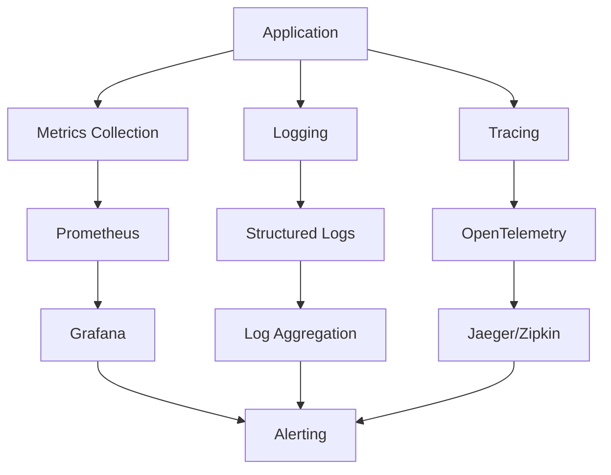

# Observability and Monitoring Guide

## Overview

This document outlines monitoring, logging, and observability practices for the Liquid Edge LLN Kit, covering both development and production deployment scenarios.

## Monitoring Architecture



## Metrics Collection

### Application Metrics

**Core Performance Metrics:**
- **Inference Latency**: p50, p95, p99 response times
- **Training Speed**: Epochs per second, convergence time
- **Memory Usage**: Peak and average memory consumption
- **Energy Consumption**: Power draw estimation for edge devices
- **Model Accuracy**: Real-time accuracy degradation detection

**System Metrics:**
- **CPU Utilization**: JAX compilation and execution overhead
- **Memory Pressure**: Python heap and JAX device memory
- **Disk I/O**: Model loading and checkpointing performance
- **Network**: Data transfer for distributed training

### Hardware-Specific Metrics

**Embedded Device Monitoring:**
- **MCU Utilization**: ARM Cortex-M CPU usage
- **SRAM Usage**: Memory allocation patterns
- **Flash Operations**: Model update and storage metrics
- **Temperature**: Thermal monitoring for performance throttling
- **Battery Level**: Power management for mobile robotics

**ROS 2 Integration Metrics:**
- **Message Latency**: End-to-end message processing time
- **Topic Throughput**: Messages per second per topic
- **Node Health**: Individual component status monitoring
- **Network Quality**: Inter-node communication reliability

## Logging Framework

### Structured Logging Configuration

```python
# logging_config.py
import logging
import json
from datetime import datetime
from typing import Dict, Any

class StructuredFormatter(logging.Formatter):
    """JSON structured logging formatter."""
    
    def format(self, record: logging.LogRecord) -> str:
        log_entry = {
            "timestamp": datetime.utcnow().isoformat(),
            "level": record.levelname,
            "logger": record.name,
            "message": record.getMessage(),
            "module": record.module,
            "function": record.funcName,
            "line": record.lineno
        }
        
        # Add extra fields if present
        if hasattr(record, 'extra_fields'):
            log_entry.update(record.extra_fields)
        
        # Add exception info if present
        if record.exc_info:
            log_entry["exception"] = self.formatException(record.exc_info)
        
        return json.dumps(log_entry)

def setup_logging(level: str = "INFO", structured: bool = True):
    """Configure application logging."""
    logging.basicConfig(
        level=getattr(logging, level.upper()),
        format='%(asctime)s - %(name)s - %(levelname)s - %(message)s' if not structured else None,
        handlers=[
            logging.StreamHandler(),
            logging.FileHandler('liquid_edge.log')
        ]
    )
    
    if structured:
        for handler in logging.getLogger().handlers:
            handler.setFormatter(StructuredFormatter())
```

### Log Categories

**Training Logs:**
```python
logger.info("Training started", extra={
    "extra_fields": {
        "epoch": epoch,
        "batch_size": batch_size,
        "learning_rate": lr,
        "model_params": param_count
    }
})
```

**Inference Logs:**
```python
logger.info("Inference completed", extra={
    "extra_fields": {
        "latency_ms": latency,
        "input_shape": input.shape,
        "output_shape": output.shape,
        "energy_estimate_mw": energy
    }
})
```

**Hardware Logs:**
```python
logger.warning("Temperature threshold exceeded", extra={
    "extra_fields": {
        "temperature_c": temp,
        "threshold_c": threshold,
        "device_id": device_id,
        "mitigation": "throttling_enabled"
    }
})
```

## Distributed Tracing

### OpenTelemetry Integration

```python
# tracing.py
from opentelemetry import trace
from opentelemetry.exporter.jaeger.thrift import JaegerExporter
from opentelemetry.sdk.trace import TracerProvider
from opentelemetry.sdk.trace.export import BatchSpanProcessor
from opentelemetry.instrumentation.jax import JaxInstrumentor

def setup_tracing(service_name: str = "liquid-edge-lln"):
    """Initialize distributed tracing."""
    trace.set_tracer_provider(TracerProvider())
    tracer = trace.get_tracer(__name__)
    
    # Configure Jaeger exporter
    jaeger_exporter = JaegerExporter(
        agent_host_name="localhost",
        agent_port=6831,
    )
    
    span_processor = BatchSpanProcessor(jaeger_exporter)
    trace.get_tracer_provider().add_span_processor(span_processor)
    
    # Instrument JAX operations
    JaxInstrumentor().instrument()
    
    return tracer

# Usage in code
tracer = setup_tracing()

@tracer.start_as_current_span("liquid_nn_training")
def train_model(model, data):
    with tracer.start_as_current_span("data_preprocessing"):
        processed_data = preprocess(data)
    
    with tracer.start_as_current_span("forward_pass"):
        output = model(processed_data)
    
    with tracer.start_as_current_span("loss_computation"):
        loss = compute_loss(output, targets)
    
    return loss
```

## Alerting and Notifications

### Alert Rules Configuration

**Performance Degradation:**
```yaml
# prometheus_alerts.yml
groups:
  - name: liquid_edge_performance
    rules:
      - alert: HighInferenceLatency
        expr: liquid_edge_inference_latency_p95 > 100
        for: 5m
        labels:
          severity: warning
        annotations:
          summary: "High inference latency detected"
          description: "95th percentile latency is {{ $value }}ms"
      
      - alert: LowAccuracy
        expr: liquid_edge_model_accuracy < 0.85
        for: 2m
        labels:
          severity: critical
        annotations:
          summary: "Model accuracy degradation"
          description: "Accuracy dropped to {{ $value }}"
```

**Resource Utilization:**
```yaml
  - name: liquid_edge_resources
    rules:
      - alert: HighMemoryUsage
        expr: liquid_edge_memory_usage_mb > 500
        for: 1m
        labels:
          severity: warning
        annotations:
          summary: "High memory usage"
          description: "Memory usage is {{ $value }}MB"
      
      - alert: HighEnergyConsumption
        expr: liquid_edge_energy_consumption_mw > 1000
        for: 10m
        labels:
          severity: critical
        annotations:
          summary: "Energy consumption too high"
          description: "Power draw is {{ $value }}mW"
```

### Notification Channels

**Slack Integration:**
```python
# alerts.py
import requests
import json

class SlackNotifier:
    def __init__(self, webhook_url: str):
        self.webhook_url = webhook_url
    
    def send_alert(self, alert: Dict[str, Any]):
        message = {
            "text": f"🚨 {alert['summary']}",
            "attachments": [{
                "color": "danger" if alert['severity'] == 'critical' else "warning",
                "fields": [
                    {"title": "Description", "value": alert['description']},
                    {"title": "Severity", "value": alert['severity']},
                    {"title": "Timestamp", "value": alert['timestamp']}
                ]
            }]
        }
        
        response = requests.post(self.webhook_url, json=message)
        return response.status_code == 200
```

## Dashboard Configuration

### Grafana Dashboard Templates

**Development Dashboard:**
- Training progress and convergence metrics
- Code quality metrics (test coverage, linting results)
- Build and deployment pipeline status
- Resource utilization during development

**Production Dashboard:**
- Real-time inference performance
- Model accuracy and drift detection
- Hardware health and energy consumption
- Error rates and system availability

**Hardware-Specific Dashboards:**
- MCU performance metrics
- Power consumption analysis
- Temperature and thermal management
- Communication latency and reliability

### Custom Metrics Collection

```python
# metrics.py
from prometheus_client import Counter, Histogram, Gauge, start_http_server
import time
from functools import wraps

# Define metrics
INFERENCE_COUNTER = Counter('liquid_edge_inferences_total', 'Total number of inferences')
INFERENCE_LATENCY = Histogram('liquid_edge_inference_latency_seconds', 'Inference latency')
MEMORY_USAGE = Gauge('liquid_edge_memory_usage_mb', 'Memory usage in MB')
MODEL_ACCURACY = Gauge('liquid_edge_model_accuracy', 'Current model accuracy')

def monitor_inference(func):
    """Decorator to monitor inference calls."""
    @wraps(func)
    def wrapper(*args, **kwargs):
        start_time = time.time()
        INFERENCE_COUNTER.inc()
        
        try:
            result = func(*args, **kwargs)
            return result
        finally:
            INFERENCE_LATENCY.observe(time.time() - start_time)
    
    return wrapper

def update_system_metrics():
    """Update system-level metrics."""
    import psutil
    process = psutil.Process()
    MEMORY_USAGE.set(process.memory_info().rss / 1024 / 1024)

# Start metrics server
start_http_server(8000)
```

## Development Environment Monitoring

### Local Development Metrics

**IDE Integration:**
- Real-time performance feedback during development
- Memory usage warnings for large models
- Energy consumption estimates
- Test execution time tracking

**Pre-commit Metrics:**
- Code quality scores
- Security scan results
- Test coverage changes
- Build time optimization

### CI/CD Pipeline Observability

**Build Metrics:**
- Build success/failure rates
- Test execution times
- Deployment frequency
- Lead time for changes

**Quality Metrics:**
- Code coverage trends
- Technical debt accumulation
- Security vulnerability counts
- Dependency freshness

## Production Monitoring

### Edge Device Monitoring

**Remote Monitoring:**
```python
# edge_monitor.py
import requests
import json
from typing import Dict, Any

class EdgeDeviceMonitor:
    def __init__(self, device_id: str, collector_endpoint: str):
        self.device_id = device_id
        self.collector_endpoint = collector_endpoint
    
    def report_metrics(self, metrics: Dict[str, Any]):
        """Send metrics to central collector."""
        payload = {
            "device_id": self.device_id,
            "timestamp": time.time(),
            "metrics": metrics
        }
        
        try:
            response = requests.post(
                self.collector_endpoint,
                json=payload,
                timeout=5
            )
            return response.status_code == 200
        except requests.RequestException:
            # Handle offline scenarios gracefully
            self._cache_metrics_locally(payload)
            return False
    
    def _cache_metrics_locally(self, payload: Dict[str, Any]):
        """Cache metrics locally when network is unavailable."""
        with open(f"/tmp/metrics_cache_{self.device_id}.json", "a") as f:
            f.write(json.dumps(payload) + "\n")
```

### Fleet Management

**Multi-Device Coordination:**
- Centralized metric aggregation
- Device health scoring
- Automated failover and recovery
- Fleet-wide performance optimization

**Model Deployment Tracking:**
- Version distribution across devices
- Rollback capabilities
- A/B testing coordination
- Performance comparison across versions

## Troubleshooting and Debugging

### Debug Mode Configuration

```python
# debug_config.py
import os
import logging

DEBUG_MODE = os.getenv('LIQUID_EDGE_DEBUG', 'false').lower() == 'true'

if DEBUG_MODE:
    # Enable detailed JAX logging
    os.environ['JAX_LOG_COMPILES'] = '1'
    os.environ['JAX_DUMP_IR_TO'] = '/tmp/jax_ir_dumps'
    
    # Enable verbose logging
    logging.getLogger('liquid_edge').setLevel(logging.DEBUG)
    
    # Enable performance profiling
    import jax.profiler
    jax.profiler.start_trace('/tmp/jax_trace')
```

### Common Issues and Solutions

**Performance Issues:**
- Monitor JAX compilation cache hit rates
- Track memory allocation patterns
- Identify bottlenecks in data preprocessing
- Optimize hardware utilization

**Accuracy Degradation:**
- Monitor input data distribution drift
- Track model parameter changes over time
- Validate against known benchmarks
- Implement automated rollback triggers

## Integration with External Tools

### Log Aggregation

**ELK Stack Integration:**
- Elasticsearch for log storage and indexing
- Logstash for log processing and enrichment
- Kibana for log visualization and analysis

**Cloud-Native Solutions:**
- AWS CloudWatch for managed monitoring
- Google Cloud Logging for structured logs
- Azure Monitor for comprehensive observability

### Security Monitoring

**SIEM Integration:**
- Security event correlation
- Anomaly detection in access patterns
- Compliance audit trail maintenance
- Incident response automation

## Future Enhancements

### Planned Improvements

**AI-Powered Monitoring:**
- [ ] Machine learning-based anomaly detection
- [ ] Predictive failure analysis
- [ ] Automated performance optimization
- [ ] Intelligent alert correlation

**Advanced Analytics:**
- [ ] Real-time model performance analysis
- [ ] Energy optimization recommendations
- [ ] Capacity planning automation
- [ ] Cost optimization insights

**Enhanced Visualization:**
- [ ] 3D performance visualization
- [ ] Interactive debugging interfaces
- [ ] Real-time collaboration tools
- [ ] Mobile monitoring applications