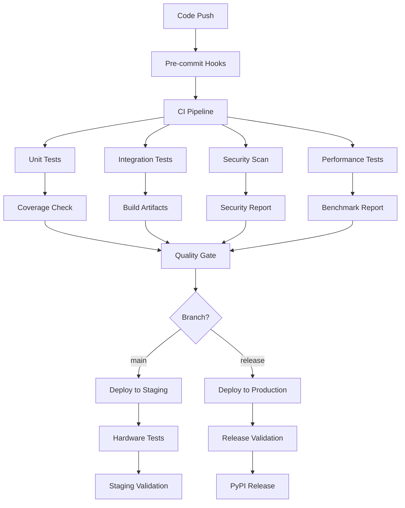

# CI/CD Strategy for Liquid Edge LLN Kit

## Overview

This document outlines the continuous integration and deployment strategy for the Liquid Edge LLN Kit, optimized for ML/AI projects with embedded system deployment requirements.

## CI/CD Pipeline Architecture



## Workflow Definitions

### 1. Pull Request Validation
```yaml
# Recommended .github/workflows/pr-validation.yml
name: PR Validation
on:
  pull_request:
    branches: [main, develop]

jobs:
  validate:
    name: Validate PR
    runs-on: ubuntu-latest
    strategy:
      matrix:
        python-version: ["3.10", "3.11", "3.12"]
    
    steps:
      - name: Checkout code
        uses: actions/checkout@v4
        
      - name: Setup Python
        uses: actions/setup-python@v4
        with:
          python-version: ${{ matrix.python-version }}
          
      - name: Cache dependencies
        uses: actions/cache@v3
        with:
          path: ~/.cache/pip
          key: ${{ runner.os }}-pip-${{ hashFiles('pyproject.toml') }}
          
      - name: Install dependencies
        run: |
          python -m pip install --upgrade pip
          pip install -e ".[dev]"
          
      - name: Run pre-commit
        uses: pre-commit/action@v3.0.0
        
      - name: Run tests
        run: pytest --cov=liquid_edge --cov-report=xml
        
      - name: Upload coverage
        uses: codecov/codecov-action@v3
        with:
          file: ./coverage.xml
          
      - name: Run security scan
        run: bandit -r src/ -f json -o bandit-report.json
        
      - name: Upload security report
        uses: actions/upload-artifact@v3
        with:
          name: security-report
          path: bandit-report.json
```

### 2. Main Branch CI
```yaml
# Recommended .github/workflows/main-ci.yml
name: Main CI
on:
  push:
    branches: [main]

jobs:
  test:
    name: Full Test Suite
    runs-on: ${{ matrix.os }}
    strategy:
      matrix:
        os: [ubuntu-latest, windows-latest, macos-latest]
        python-version: ["3.10", "3.11", "3.12"]
        jax-backend: ["cpu"]
        include:
          - os: ubuntu-latest
            python-version: "3.11"
            jax-backend: "gpu"
    
    steps:
      - uses: actions/checkout@v4
      - name: Setup Python
        uses: actions/setup-python@v4
        with:
          python-version: ${{ matrix.python-version }}
          
      - name: Setup JAX GPU (if needed)
        if: matrix.jax-backend == 'gpu'
        run: |
          pip install "jax[cuda]" -f https://storage.googleapis.com/jax-releases/jax_cuda_releases.html
          
      - name: Install dependencies
        run: |
          pip install -e ".[dev,deployment]"
          
      - name: Run comprehensive tests
        run: |
          pytest --cov=liquid_edge --cov-report=xml --benchmark-save=benchmark
          
      - name: Performance regression check
        run: |
          python scripts/check_performance_regression.py
          
      - name: Build wheel
        run: |
          python -m build
          
      - name: Upload artifacts
        uses: actions/upload-artifact@v3
        with:
          name: wheel-${{ matrix.os }}-py${{ matrix.python-version }}
          path: dist/

  hardware-simulation:
    name: Hardware Simulation Tests
    runs-on: ubuntu-latest
    needs: test
    
    steps:
      - uses: actions/checkout@v4
      - name: Setup ARM toolchain
        run: |
          sudo apt-get update
          sudo apt-get install gcc-arm-none-eabi qemu-system-arm
          
      - name: Setup ESP-IDF
        run: |
          git clone --recursive https://github.com/espressif/esp-idf.git
          cd esp-idf && ./install.sh
          
      - name: Run MCU simulation tests
        run: |
          source esp-idf/export.sh
          pytest tests/hardware_simulation/ -v
```

### 3. Release Pipeline
```yaml
# Recommended .github/workflows/release.yml
name: Release
on:
  push:
    tags:
      - 'v*'

jobs:
  validate-release:
    name: Validate Release
    runs-on: ubuntu-latest
    
    steps:
      - uses: actions/checkout@v4
      - name: Setup Python
        uses: actions/setup-python@v4
        with:
          python-version: "3.11"
          
      - name: Install dependencies
        run: |
          pip install -e ".[dev,deployment,ros2]"
          
      - name: Run full test suite
        run: |
          pytest --cov=liquid_edge --cov-fail-under=85
          
      - name: Validate documentation builds
        run: |
          cd docs && make html
          
      - name: Security audit
        run: |
          pip-audit --desc --output audit-report.json --format json
          
      - name: SBOM generation
        run: |
          pip install cyclonedx-bom
          cyclonedx-py -o sbom.json

  build-release:
    name: Build Release Artifacts
    needs: validate-release
    runs-on: ${{ matrix.os }}
    strategy:
      matrix:
        os: [ubuntu-latest, windows-latest, macos-latest]
    
    steps:
      - uses: actions/checkout@v4
      - name: Setup Python
        uses: actions/setup-python@v4
        with:
          python-version: "3.11"
          
      - name: Build wheel
        run: |
          python -m pip install --upgrade pip build
          python -m build
          
      - name: Upload release artifacts
        uses: actions/upload-artifact@v3
        with:
          name: release-${{ matrix.os }}
          path: dist/

  pypi-release:
    name: PyPI Release
    needs: build-release
    runs-on: ubuntu-latest
    environment:
      name: pypi
      url: https://pypi.org/p/liquid-edge-lln
    permissions:
      id-token: write
    
    steps:
      - name: Download artifacts
        uses: actions/download-artifact@v3
        with:
          pattern: release-*
          merge-multiple: true
          path: dist/
          
      - name: Publish to PyPI
        uses: pypa/gh-action-pypi-publish@release/v1
        with:
          packages-dir: dist/
```

## Quality Gates

### Branch Protection Rules
```yaml
# Recommended branch protection for main
required_status_checks:
  strict: true
  contexts:
    - "PR Validation (3.10)"
    - "PR Validation (3.11)"
    - "PR Validation (3.12)"
    - "Security Scan"
    - "Performance Check"

enforce_admins: true
required_pull_request_reviews:
  required_approving_review_count: 1
  dismiss_stale_reviews: true
  require_code_owner_reviews: true

restrictions:
  users: []
  teams: ["liquid-edge/maintainers"]
  apps: []
```

### Automated Quality Checks
1. **Code Coverage**: Minimum 85% coverage required
2. **Security Scanning**: No high/critical vulnerabilities
3. **Performance**: No regression > 5% from baseline
4. **Code Quality**: Ruff/Black/MyPy compliance
5. **Dependency**: Up-to-date and vulnerability-free

## Deployment Strategies

### Staging Environment
```yaml
# Staging deployment configuration
staging:
  environment: staging
  python_version: "3.11"
  dependencies:
    - "liquid-edge-lln[dev,deployment]"
  hardware_simulation: true
  monitoring:
    - prometheus
    - grafana
  testing:
    - smoke_tests
    - integration_tests
```

### Production Release Process
1. **Release Candidate**: Deploy to staging for validation
2. **Hardware Testing**: Run on physical test hardware
3. **Performance Validation**: Benchmark against baseline
4. **Security Review**: Complete security audit
5. **Documentation**: Update release notes and docs
6. **PyPI Release**: Automated publication
7. **GitHub Release**: Tag and release notes

## Monitoring and Observability

### CI/CD Metrics
- Build success rate
- Test execution time
- Deployment frequency
- Mean time to recovery
- Security scan results

### Integration with Monitoring Tools
```yaml
# Example monitoring integration
monitoring:
  prometheus:
    endpoints:
      - /metrics/ci
      - /metrics/deployment
  grafana:
    dashboards:
      - ci_pipeline_health
      - deployment_metrics
      - test_performance
```

## Security Integration

### Security Scanning Pipeline
```yaml
security_checks:
  - name: Dependency scan
    tool: pip-audit
    frequency: every_commit
    
  - name: Code analysis
    tool: bandit
    frequency: every_commit
    
  - name: Container scan
    tool: trivy
    frequency: release
    
  - name: SBOM generation
    tool: cyclonedx
    frequency: release
```

### Secret Management
- Use GitHub Secrets for sensitive data
- Rotate secrets regularly
- Audit secret access
- Use environment-specific secrets

## Performance Optimization

### Caching Strategy
```yaml
caching:
  pip_cache:
    key: ${{ runner.os }}-pip-${{ hashFiles('pyproject.toml') }}
    paths: ~/.cache/pip
    
  test_cache:
    key: ${{ runner.os }}-pytest-${{ hashFiles('tests/**/*.py') }}
    paths: .pytest_cache
    
  build_cache:
    key: ${{ runner.os }}-build-${{ github.sha }}
    paths: build/
```

### Parallel Execution
- Run tests in parallel using pytest-xdist
- Matrix builds for different environments
- Concurrent security and performance checks
- Parallel artifact uploads

## Rollback Strategy

### Automatic Rollback Triggers
- Failed health checks
- Performance degradation > 10%
- Security vulnerability detection
- Critical test failures

### Manual Rollback Process
1. **Identify Issue**: Monitor alerts or manual detection
2. **Stop Deployment**: Halt current deployment pipeline
3. **Rollback Code**: Revert to last known good version
4. **Validate**: Run smoke tests on rollback
5. **Communicate**: Notify team and stakeholders
6. **Post-mortem**: Analyze root cause

## Documentation Integration

### Automated Documentation
- API docs generation from docstrings
- README updates from template
- Performance benchmark inclusion
- Hardware compatibility matrix updates

### Release Documentation
- Automated changelog generation
- Breaking changes documentation
- Migration guides for major versions
- Hardware support matrix updates

This CI/CD strategy ensures reliable, secure, and efficient delivery of the Liquid Edge LLN Kit while maintaining high quality standards and supporting the unique requirements of ML/embedded system development.