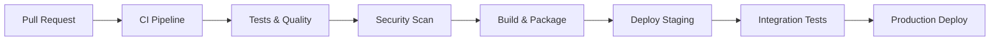

# CI/CD Workflow Guide

## Overview

This document outlines the Continuous Integration and Continuous Deployment setup for the Liquid Edge LLN Kit repository.

## Workflow Architecture



## Required GitHub Actions Workflows

### 1. Main CI Pipeline (.github/workflows/ci.yml)

**Triggers:**
- Pull requests to main branch
- Pushes to main branch
- Scheduled runs (weekly)

**Jobs:**
- **Test Matrix**: Python 3.10, 3.11, 3.12 on Ubuntu/macOS/Windows
- **Code Quality**: Ruff, Black, MyPy static analysis
- **Test Coverage**: Pytest with coverage reporting (>90% required)
- **Documentation**: Sphinx build validation
- **Pre-commit**: Validate all hooks pass

### 2. Security Scanning (.github/workflows/security.yml)

**Jobs:**
- **Dependency Scan**: Safety, Bandit, pip-audit
- **SAST**: CodeQL analysis for Python
- **Secret Detection**: GitLeaks, TruffleHog
- **SBOM Generation**: Generate and upload software bill of materials
- **License Compliance**: Check for compatible licenses

### 3. Release Pipeline (.github/workflows/release.yml)

**Triggers:**
- Git tags matching v*.*.*
- Manual workflow dispatch

**Jobs:**
- **Build Wheels**: Build Python packages for all platforms
- **Run Full Test Suite**: Comprehensive testing including hardware simulation
- **Security Review**: Final security validation
- **PyPI Publish**: Automated package publishing
- **GitHub Release**: Create release with changelogs and artifacts
- **Container Images**: Build and push development containers

### 4. Deployment (.github/workflows/deploy.yml)

**Jobs:**
- **Documentation Deploy**: Update docs site (Read the Docs/GitHub Pages)
- **Example Updates**: Deploy updated examples to demo repositories
- **Performance Benchmarks**: Run and publish performance comparisons
- **Hardware Testing**: Deploy to connected embedded test devices

## Environment Configuration

### Secrets Required
```yaml
PYPI_API_TOKEN: PyPI publishing token
CODECOV_TOKEN: Code coverage reporting
DOCKER_HUB_TOKEN: Container registry access
HARDWARE_LAB_SSH: Access to embedded test lab
SLACK_WEBHOOK: Team notifications
```

### Environment Variables
```yaml
PYTHON_VERSIONS: "3.10,3.11,3.12"
COVERAGE_THRESHOLD: "90"
BENCHMARK_BASELINE: "main"
DOCS_URL: "https://liquid-edge.readthedocs.io"
```

## Quality Gates

### Pull Request Requirements
- [ ] All CI checks pass
- [ ] Code coverage ≥ 90%
- [ ] No security vulnerabilities
- [ ] Documentation updated
- [ ] Performance regression < 5%
- [ ] Two approving reviews from maintainers

### Release Criteria
- [ ] Full test suite passes on all platforms
- [ ] Security scan clean
- [ ] Hardware validation complete
- [ ] Documentation up to date
- [ ] CHANGELOG.md updated
- [ ] Version bumped correctly

## Branch Protection Rules

```yaml
main:
  required_status_checks:
    - ci/tests
    - ci/quality
    - ci/security
    - ci/docs
  required_reviews: 2
  dismiss_stale_reviews: true
  require_code_owner_reviews: true
  restrict_pushes: true
```

## Performance Monitoring

### Benchmarks Run on Every PR
- **Training Speed**: JAX compilation and execution time
- **Model Size**: Generated C code size and RAM usage
- **Energy Efficiency**: Simulated power consumption
- **Deployment Time**: MCU flash and boot time

### Metrics Tracked
- Test execution time trends
- Build time optimization
- Package size growth
- Documentation build performance

## Hardware-in-the-Loop Testing

### Test Devices
- STM32H743 Development Board
- ESP32-S3 DevKit
- nRF52840 DK
- Raspberry Pi 4 (ROS2 integration)

### Automated Testing
- Flash latest firmware
- Run sensor simulation tests
- Validate real-time performance
- Energy consumption measurement
- Connectivity and communication tests

## Rollback Procedures

### Failed Deployment
1. Revert to last known good release
2. Notify team via Slack
3. Create hotfix branch if needed
4. Fast-track critical fixes

### Security Issues
1. Immediate removal of affected versions
2. Security advisory publication
3. Coordinated disclosure timeline
4. Patch release within 24 hours

## Integration with External Services

### Code Quality
- **Codecov**: Coverage tracking and reporting
- **SonarCloud**: Deep code analysis and technical debt
- **Snyk**: Continuous security monitoring

### Documentation
- **Read the Docs**: Automated documentation building
- **Algolia DocSearch**: Enhanced documentation search

### Communication
- **Slack**: Build notifications and alerts
- **GitHub Discussions**: Community engagement
- **Discord**: Developer community

## Local Development Workflow

### Pre-commit Integration
```bash
# Install hooks
pre-commit install

# Run manually
pre-commit run --all-files

# Skip hooks (emergency only)
git commit --no-verify
```

### Testing Locally
```bash
# Run full test suite
make test

# Run with coverage
make test-coverage

# Run security checks
make security-check

# Build documentation
make docs

# Hardware simulation
make test-hardware-sim
```

## Metrics and KPIs

### Development Velocity
- Mean time to merge (target: < 2 days)
- Build success rate (target: > 95%)
- Test flakiness rate (target: < 2%)

### Quality Metrics
- Code coverage percentage
- Technical debt ratio
- Security vulnerabilities count
- Documentation coverage

### Performance Indicators
- Package download growth
- Community contribution rate
- Issue resolution time
- Hardware deployment success rate

## Troubleshooting

### Common CI Failures
1. **Flaky Tests**: Retry mechanism and test isolation
2. **Dependency Conflicts**: Lock file management
3. **Hardware Unavailable**: Fallback to simulation
4. **Rate Limits**: Token rotation and caching

### Debug Strategies
- Use workflow_dispatch for manual testing
- Enable debug logging for complex failures
- Save artifacts for post-mortem analysis
- Maintain test environment replicas locally

## Future Enhancements

### Planned Improvements
- [ ] Matrix builds for different JAX backends
- [ ] Automated performance regression detection
- [ ] Advanced fuzzing integration
- [ ] Multi-platform container builds
- [ ] Automated license scanning
- [ ] Enhanced hardware lab automation

### Monitoring Upgrades
- [ ] Real-time build dashboards
- [ ] Predictive failure analysis
- [ ] Automated performance benchmarking
- [ ] Integration with monitoring stack