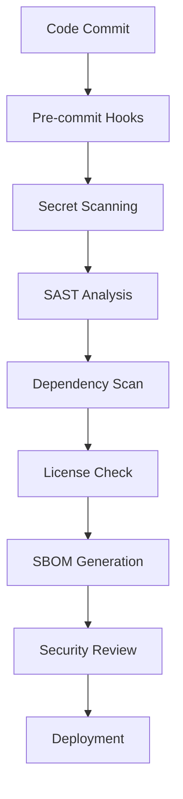

# Security Workflow Guide

## Overview

This document outlines comprehensive security practices and automated scanning for the Liquid Edge LLN Kit repository.

## Security Architecture



## Automated Security Scanning

### 1. Pre-commit Security Hooks

**Implemented Checks:**
- **Secret Detection**: GitLeaks, TruffleHog
- **Sensitive Files**: AWS credentials, SSH keys, certificates
- **Hardcoded Passwords**: Common patterns and entropy analysis
- **Debug Statements**: Remove debugging code before commit

### 2. Static Application Security Testing (SAST)

**Tools Integration:**
- **Bandit**: Python security linting
- **Semgrep**: Multi-language security patterns
- **CodeQL**: GitHub native security analysis
- **Safety**: Python dependency vulnerability scanning

### 3. Dependency Security Management

**Automated Scans:**
- **pip-audit**: Python package vulnerability scanning
- **Snyk**: Comprehensive dependency analysis
- **FOSSA**: License compliance and security
- **Dependabot**: Automated security updates

### 4. Container Security

**Docker Security:**
- **Hadolint**: Dockerfile best practices
- **Trivy**: Container vulnerability scanning
- **Cosign**: Container image signing
- **SBOM**: Software Bill of Materials generation

## Security Policies

### Vulnerability Disclosure

**Timeline:**
- **Critical**: 24 hours response, 72 hours fix
- **High**: 1 week response, 2 weeks fix  
- **Medium**: 2 weeks response, 1 month fix
- **Low**: 1 month response, next release fix

**Process:**
1. Security issue reported via SECURITY.md
2. Acknowledgment within 24 hours
3. Assessment and triage
4. Fix development in private fork
5. Coordinated disclosure with advisory
6. Public patch release
7. Post-mortem and process improvement

### Supply Chain Security

**SLSA Compliance Level 2:**
- **Source Integrity**: Signed commits required
- **Build Integrity**: Reproducible builds
- **Provenance**: SBOM for all releases  
- **Isolation**: Sandboxed build environment

**Signing Requirements:**
- All release artifacts signed with GPG
- Container images signed with Cosign
- PyPI packages signed with Sigstore
- Git tags signed and verified

### Access Control

**Repository Security:**
- **Branch Protection**: Main branch requires reviews
- **Required Checks**: All security scans must pass
- **Admin Privileges**: Limited to 2 maintainers
- **2FA Required**: All contributors must enable 2FA

**Secrets Management:**
- **GitHub Secrets**: Encrypted environment variables
- **Rotation Policy**: Quarterly secret rotation
- **Principle of Least Privilege**: Minimal access scope
- **Audit Logging**: All access attempts logged

## Hardware Security

### Embedded Device Security

**Firmware Protection:**
- **Secure Boot**: Verified boot chain for MCUs
- **Code Signing**: All firmware digitally signed
- **Encryption**: AES-256 for sensitive data
- **Tamper Detection**: Hardware security features

**Communication Security:**
- **TLS 1.3**: All network communications encrypted
- **Certificate Pinning**: Prevent MITM attacks
- **Message Authentication**: HMAC for all messages
- **Key Rotation**: Regular cryptographic key updates

### ROS 2 Security

**SROS 2 Integration:**
- **DDS Security**: Encrypted robot communications
- **Authentication**: Node identity verification
- **Authorization**: Fine-grained permissions
- **Audit Logging**: Security event monitoring

## Compliance Framework

### Regulatory Alignment

**Standards Compliance:**
- **NIST Cybersecurity Framework**: Risk management
- **ISO 27001**: Information security management
- **Common Criteria**: Security evaluation
- **FedRAMP**: Federal security requirements

**Industry Standards:**
- **IEC 62443**: Industrial cybersecurity
- **ISO 26262**: Automotive functional safety
- **DO-178C**: Avionics software development
- **Medical Device Regulation**: Healthcare applications

### Audit Requirements

**Regular Assessments:**
- **Quarterly**: Internal security review
- **Semi-annual**: External penetration testing
- **Annual**: Comprehensive security audit
- **Continuous**: Automated vulnerability scanning

**Documentation:**
- **Security Architecture**: System design documentation
- **Risk Assessment**: Threat modeling and mitigation
- **Incident Response**: Security event procedures
- **Compliance Evidence**: Audit trail maintenance

## Security Tools Configuration

### Bandit Configuration (.bandit)

```yaml
skips: ['B101', 'B601']  # Skip assert and shell usage in tests
exclude_dirs: ['tests', 'examples']
confidence_level: medium
severity_level: medium
```

### Safety Configuration

```yaml
ignore_vulnerabilities:
  # Example: 
  # - 12345  # False positive for development dependency
report_format: json
output_file: safety-report.json
```

### Secret Scanning Patterns

**Custom Detection Rules:**
- Hardware serial numbers
- API endpoints for embedded devices  
- Cryptographic key patterns
- Database connection strings
- Cloud service credentials

## Incident Response

### Security Event Classification

**Severity Levels:**
- **P0**: Active exploitation, data breach
- **P1**: High-risk vulnerability, system compromise
- **P2**: Medium-risk issue, potential exposure
- **P3**: Low-risk finding, best practice violation

### Response Procedures

**Immediate Actions (0-4 hours):**
1. Assess impact and scope
2. Contain the incident
3. Notify stakeholders
4. Begin forensic analysis
5. Document all actions

**Short-term Actions (4-24 hours):**
1. Develop remediation plan
2. Apply temporary mitigations
3. Update monitoring and detection
4. Coordinate with external parties
5. Prepare public communications

**Long-term Actions (1-7 days):**
1. Implement permanent fixes
2. Conduct post-incident review
3. Update security procedures
4. Enhance detection capabilities
5. Share lessons learned

## Security Metrics

### Key Performance Indicators

**Detection Metrics:**
- Mean Time to Detection (MTTD): < 4 hours
- Mean Time to Response (MTTR): < 24 hours
- False Positive Rate: < 5%
- Coverage of OWASP Top 10: 100%

**Prevention Metrics:**
- Vulnerability Density: < 1 per 1000 lines
- Security Training Completion: 100%
- Penetration Test Pass Rate: > 95%
- Compliance Score: > 90%

### Continuous Monitoring

**Automated Dashboards:**
- Security scan results trending
- Vulnerability age and resolution time
- Dependency security status
- Compliance framework coverage

**Alerting Thresholds:**
- Critical vulnerabilities: Immediate
- High-risk dependencies: 1 hour
- Failed security scans: 15 minutes
- Unusual access patterns: Real-time

## Security Training

### Developer Education

**Required Training:**
- Secure coding practices
- Threat modeling techniques
- Cryptography fundamentals
- Hardware security principles

**Regular Updates:**
- Monthly security bulletins
- Quarterly hands-on workshops
- Annual security conference attendance
- Incident response simulations

### Certification Requirements

**Security Certifications:**
- **Lead Developers**: CISSP or equivalent
- **DevOps Engineers**: GSEC or similar
- **Hardware Engineers**: Security+ minimum
- **All Contributors**: Security awareness training

## Integration Points

### CI/CD Pipeline Security

**Build-time Checks:**
- Dependency vulnerability scanning
- Static code analysis
- Secret detection
- License compliance verification

**Runtime Security:**
- Container image scanning
- Network policy enforcement
- Resource usage monitoring
- Anomaly detection

### Third-party Integrations

**Security Services:**
- **Snyk**: Continuous vulnerability monitoring
- **GitGuardian**: Secret detection and remediation
- **Checkmarx**: Advanced SAST analysis
- **Veracode**: Dynamic application security testing

## Future Enhancements

### Planned Security Improvements

**Near-term (3 months):**
- [ ] Implement runtime application self-protection (RASP)
- [ ] Deploy software composition analysis (SCA)
- [ ] Enhance container security scanning
- [ ] Add binary analysis capabilities

**Medium-term (6 months):**
- [ ] Machine learning threat detection
- [ ] Zero-trust network architecture
- [ ] Hardware security module integration
- [ ] Advanced persistent threat (APT) detection

**Long-term (12 months):**
- [ ] Quantum-safe cryptography preparation
- [ ] AI-powered security orchestration
- [ ] Blockchain-based software supply chain
- [ ] Autonomous incident response system